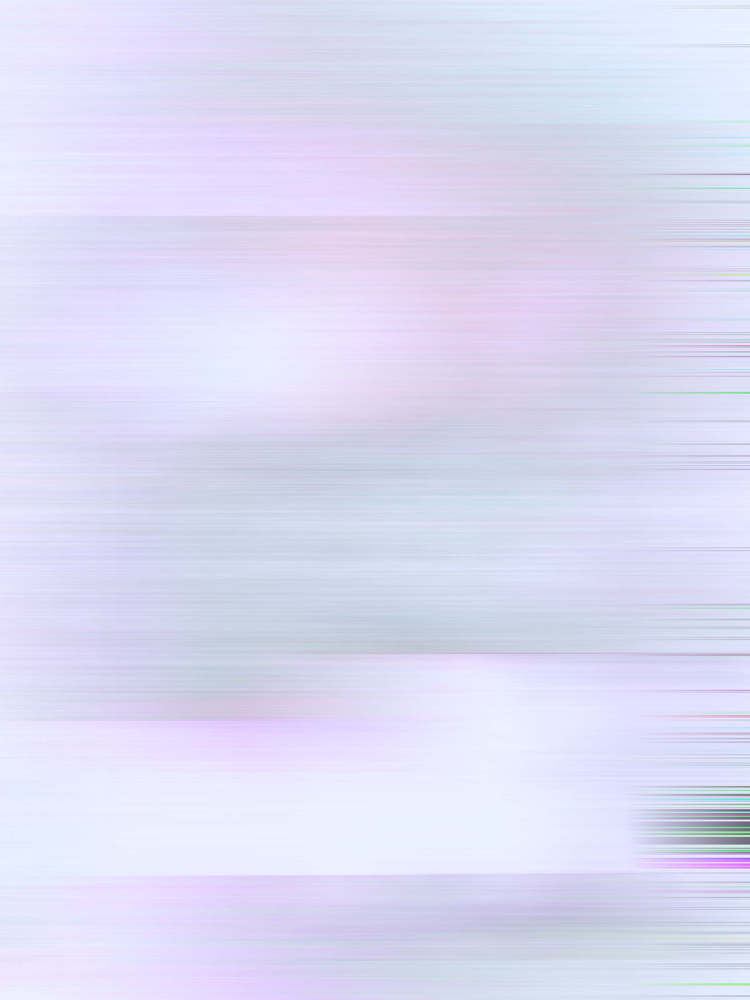

# A B O U T

Alternative Bio

An inter disciplinary designer with a hybrid profile on a mission to improve everyday life for people and the planet. With a blend of physical and digital technologies, arts, and sensations to empower citizens through artefacts and storytelling to take action. Committed to making information visible and accessible with the core philosophy that any meaningful exchange of information between people must carry emotions and experiences to create knowledge and drive change. With a background in product and furniture design I work hands on with a natural talent for visualisation and form.

Bio

I’m Josephine. I have a background in Product/ Furniture design with focus on working with social and environmental issues and how the things around us affect people, mental health and the environment. 

I am an analytical problem-solver with a desire to understand how things fit together in a greater context where finding patterns and connections in complex situations and systems become possibilities for reforming and improving. With interests in research, psychology, well-being and function I seek to localise the core and essence of a problem or situation, working with solutions where the sum of parts, materials, space, objects and people come together as a whole.

My fight lies in creating a balance in the relationship between humans and nature and all that is in-between. Working with materials, production methods and communities to create regenerative environments.

 **[my website](https://community.emergentfutures.io/courses/5566525/content)**

