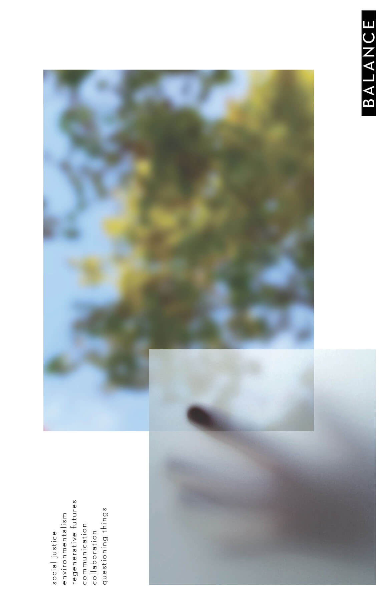

---
hide:
    - toc
---

# Bootcamp

What is my ‘Fight’?

When starting The Master in Design for Emergent Futures we were asked to introduce ourselves and our ‘Fight’ or quest that drives us in a poster. The assignment was at this stage, for me, a difficult question to answer concretely as I have many fields of interest and that everything is connected.

With a reflective and questioning mindset I have a drive to understand different perspectives, an eagerness to learn new things and take on new challenges. I am an analytical problem-solver with a desire to understand how things fit together in a greater context where finding patterns and connections in complex situations and systems become possibilities for reforming and improving. With interests in research, psychology, well-being and function I seek to localise the core and essence of a problem or situation, working with solutions where the sum of parts, materials, space, objects and people come together as a whole. 

With a background in Product/ Furniture design my focus has been on working with social issues
and how the things around us affect people, mental health and the environment. My fight lies in creating a balance in the relationship between humans and nature and all that is in-between. Working with materials, production methods and communities to create regenerative environments.

