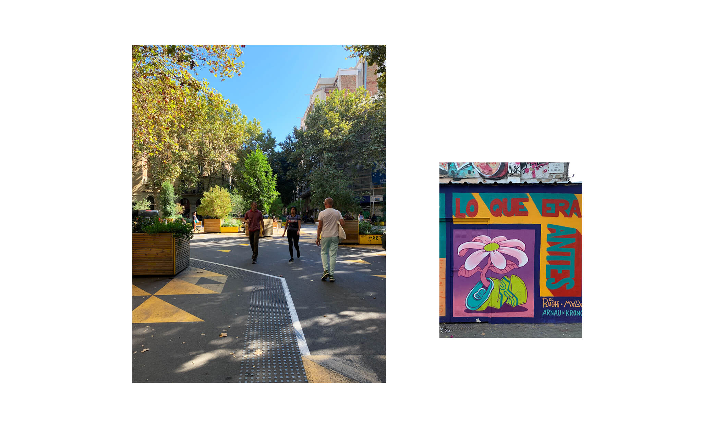

---
hide:
    - toc
---

# ATLAS OF WEAK SIGNALS

Josephine Bourghardt 16.10.22

During the second week of MDEF we were introduced to the Atlas of Weak Signals. Weak signals can be defined as the first indicator of a change or an emerging issue in the present that may become significant in the future. Investigating and discovering weak signals has been used in business settings to spot upcoming trends for investment. 

The Atlas of Weak Signals is a toolkit consisting of cards that recognise weak signals, random triggers and areas of opportunity into a practical space to navigate and understand possible emerging scenarios based on underlying trends in our current world. It facilitates seeking opportunities, threats, challenges  and shared visions for innovation, policymaking, intervention, research and business opportunities in the future. 

The first exercise when using the AoWS toolkit was to randomly choose two weak signals, three random triggers and one area of opportunity and analyse what these mean, how they can be connected and what possible interventions could be. This what a great exercise to start understanding the methodology of how they can be used without directly choosing own areas of interest.

Afterwards we looked through all the cards and chose one that was associated with our ‘fight’ posters and vision. Thereafter we walked around the city to take photos of interventions regarding the card we chose. I chose the card Regenerative Design as it is an overall concept of my vision and Fight poster. 

While walking around the city I passed through the SuperBlocks in Sant Antoni, one of the projects opening up spaces in the city where cars have been dominant. The projects Super Blocks address challenges such as mobility, public space, bio diversity and social cohesion, involving the participation of local residents and organisations. It is a low cost, small scale intervention that adds spaces of greenery for both humans and animals to coexist in urban environments. 

While continuing the journey through the city I walked passed a wall of graffiti paintings, where one of the art pieces cited ‘Lo que era antes’ - what has been - with a painting of a flower growing out of a tin can. What if what we produced could actually provide nurture to this flower growing, instead of overusing this flowers natural resources and spreading material that it can’t use…

PERSONAL DESIGN SPACE

This toolkit is part of a method to help us communicate thoughts and concepts while supporting to detect a direction of our vision and areas of interest. When starting on my personal design space showing areas of interest and direction narrowing down the selection of cards to just a few was a challenge. I realised I have many interests, although when connecting them there is an overall theme. 
