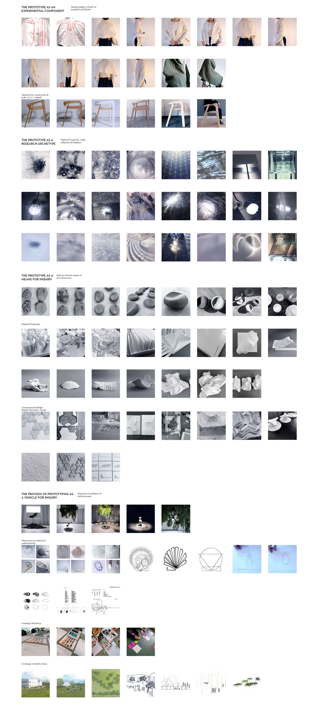

---
hide:
    - toc
---

# **DESIGN STUDIO**

THE ROLES OF PROTOTYPING 

There are different roles a prototype plays within a design process, but in principal the basis lies in quickly testing and quickly making mistakes at low costs to observe, record and analyse the output. 

*The prototype as an experimental component* where prototyping tests a hypothesis. Through statistical analysis the prototypes test attributes such as: usability tests of the prototypes, experiential trials to assess the design attributes such as aesthetics, color, texture details, material properties or cases where the prototype is treated as a physical hypothesis.

In product and furniture design rapid prototyping is a substantial part of the design process to test and understand form aesthetically and functionally, scale, construction and usability. Usually starting in a scale of 1:5 to quickly create and assess alternations in form and structure. Thereafter moving on to a rapid prototype in the scale of 1:1 to assess proportions aesthetically to the human body and space. It is a quick way to assess and test alternations that are thereafter tested in a functional 1:1 scale prototype testing ergonomics, usability and interaction, details and materials.

*The prototype as a means of inquiry* where prototypes are developed and deployed as instruments of inquiry to collect, record and measure phenomena. Prototypes are in this case used as an open-ended exploration to find information where there is no hypothesis. It can be a qualitative and /or quantitive study that can be combined with other methods of finding information such as interviews. 

During projects this way of using prototypes can be a great way of understanding material properties by experimenting structural attributes, reformation and qualities. It is also a great way to understand how people behave or understand situations to learn new perspectives and understandings of a situation by using cultural or digital probes.

*The prototype as a research archetype* as embodiments of concepts, understandings or design spaces that can be argued to constitute contributions to the discipline. The role the prototype plays in this contribution is usually exemplary and used to show different possibilities of how things could be. It illustrates or demonstrates possibilities as a physical embodiment of research concept,’understanding or design research space. It is conceptual and methodological, where the result doesn’t have to be a physical product, but can be a render, sketch or visualisation.

*The process of prototyping as a vehicle for inquiry* where the process of making an artefact becomes a qualitative instrumental tool in design research. The process is documented, analysed, critically assessed and written up, and the research contribution is tied not to the artefact itself but the process of prototyping and how it generates knowledge. It becomes a driver for the direction of research and can be seen in Co-Design and Participatory Design as well as Digital and Cultural Probes where people are brought into the design process.

With this method of prototyping many different perspectives and understandings are brought into the process and become direction in where the project could be moving towards. The process becomes the important direction and by documenting and assessing the information that becomes visible along the way is can give more knowledge and insight than the actual result, if there is one. 

Throughout projects the different roles of prototyping provide information to help understand the situation and assess if it’s moving in the right direction and solving the right problem. In many projects they intertwine and are used within different phases of the process to collect and assess information and I use most of them in most projects to find inspiration, understand context and users, as a means of experimenting and testing hypothesis. 

During this year I’m looking to work more with prototyping as a vehicle for inquiry, to work participatory with communities and other fields of expertise. In the past this is the one means of prototyping I have worked the least with, but one that I see one of the most interesting to evolve in. Furthermore using prototyping as a research archetype to illustrate and visualise possibilities and ideas as a means to start discussions and reflections. 

DESIGN SPACE

