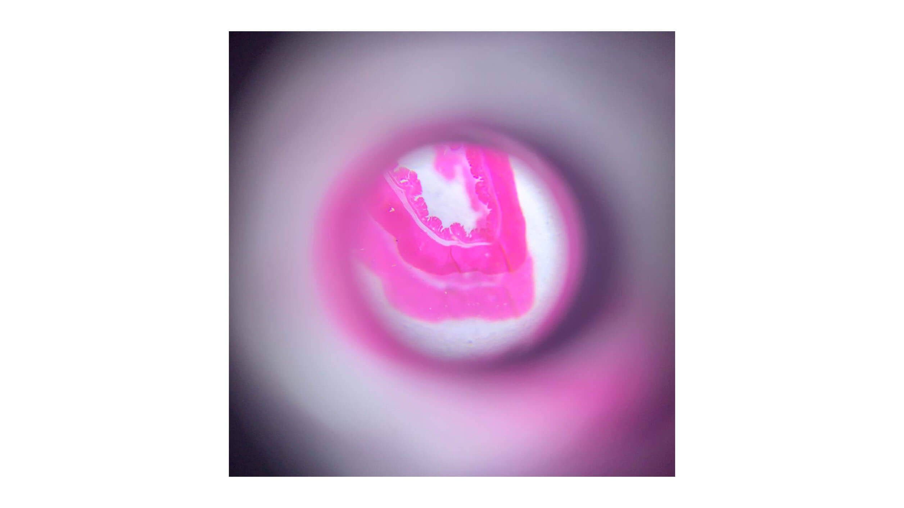
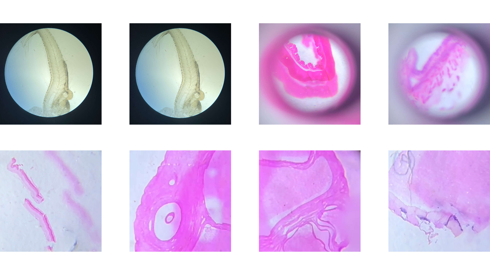
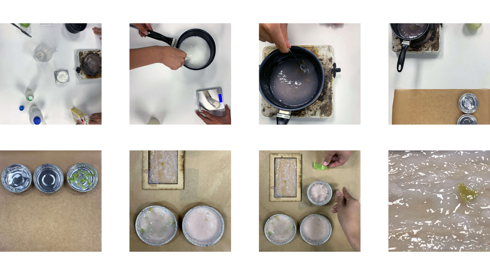
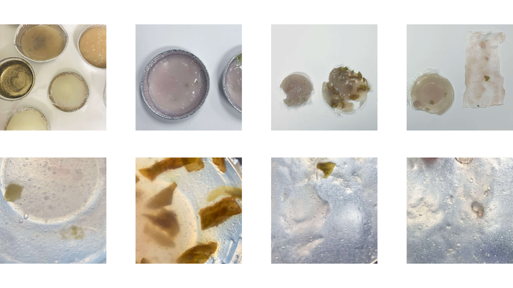

---
hide:
    - toc
---

# **BIO AGRI ZERO**

This week we were introduced to the basics of biology, synthetic biology and bio materials. Biology can be seen as the study of life and can be studied very broadly focusing on the whole planet or in very specific studies of for example microscopic structures like bacteria or DNA. 

We got an introduction to microbiology, the study of microorganisms, a diverse group of generally minute simple life-forms that include bacteria, archaea, algae, fungi, protozoa, and viruses. The field is concerned with the structure, function, and classification of such organisms and with ways of both exploiting and controlling their activities. 

Thereafter we made our own DIY laboratory and created an All Purpose Medium with simple ingredients that can be found in the local supermarket to grow and analyse living matter. We went hunting for bacteria and chose to take samples from the bathroom door handle and different fingerprints. This was placed in the incubator to later observe and analyse if or what kind of bacteria grows.

We learned the importance of labelling and sorting samples to know what is what and how it has been handled, taking notes on recipes, procedures, changes and time slots. We learned the procedure of using scientific methods to experiment to be able to communicate and analyse outcomes.

We looked at different tissue and organs through microscopes to understand how different microscopes work. Learning about the possibilities of making your own DIY microscope. 

 
With other recipes in the DIY Lab we made different Bio Materials, again with simple ingredients that can be found in supermarkets. Our group worked with Glycerine, Maizena and Vinegar, resulting in a Bio 'Plastic' with slightly transparent property depending on the thickness chosen. With flexible characteristics the thinnest sample seems to suit this recipe the best. 

Brexit paves the way for gene-edited crops
Published 29 September 2021

By Pallab Ghosh

In the BBC article ‘Brexit paves the way for gene-edited crops you can read about how the UK discusses allowing gene edited fruits and vegetables to be commercially grown and available. Due to Brexit, the UK is no longer a part of the European Union and therefor neither the restrictions they have regarding gene modified or edited farming and produce. Many scientists believe that they can use gene editing to develop fruit, vegetables and cereals that are more nutritious and productive, as well as hardier varieties that can withstand the extremes of weather brought about by climate change, but this is restricted in many countries (Ghosh, 2021).

As populations keep growing it is expected that food production will have to double in the next 50 years. Unintentional environmental factors effect crops where an average of 33% of all fruit and vegetables are wasted or lost to causes such as disease, drought, extremes of temperature, and other environmental stresses. Plant gene editing has a profound potential to create new crops with desirable characteristics that could improve agricultural production. 

Manipulation of plant genomes has been achieved with the gene-editing tool CRISPR–Cas9. Mutations in the genomes can apply and activate valuable traits in many crop species, such as lifecycles, additional nutrition and growth. This may improve the overall efficiency of fruit and vegetable production so that costs may be lowered, thereby bringing fresh produce within the means of more populations and strengthening the industry as well as worldwide health (Shipman, et al, 2021) 

These possibilities of changing the traits of produce to increase nutrition and production can definitely help solve some of the issues from growing populations and environmental impacts in the future, but at what cost? The article continues with discussing the UK governments future thoughts of also reviewing regulations of all genetically modified organisms which includes allowing commercial development and farming of gene-edited and genetically modified animals. This can make them more productive, resistant to some diseases and better withstand weather conditions. Many scientists and others within the field are welcoming these changes, while there are groups that are sceptical to the ethical impacts it can have on production methods and safety of animals and other living organisms.

In another BBC article - ‘Rules to create gene-edited farm animals must put welfare first - review’ a report by the Nuffield Council for Bioethics warns that removing the current ban on the commercial development of gene-edited animals could increase livestock suffering. As farming is a business there can be different understandings and thoughts from breeders of farm animals where to tread a line between what they can get out of it and animal welfare. If gene edited animals could better tolerate poor conditions without any apparent health impacts it causes tension between the producer and animal welfare. 

In an experiment carried out during the 1980s a human gene was added into the DNA of pigs expecting them to grow faster and become leaner. The experiment succeeded where the pigs weight gain increased, together with feed efficiency, and carcass fat reduced. In a commercial and productive point of view this experiment was successful, but beyond these effects the pigs also suffered from several unanticipated serious health problems and suffering. 

*"Those involved in policing must look beyond solely questions of food safety and keep in mind an overall vision of a food and farming system that supports sustainable farming and improves standards of animal welfare (Ghosh, 2021).*

Reading these articles about subjects that could soon become reality pose the questions of who and what will be next? Human genome editing has the potential to advance our ability to treat and cure disease with benefits including faster and more accurate diagnosis, more targeted treatments and prevention of genetic disorders. Somatic gene therapies, which involve modifying a patient’s DNA to treat or cure a disease, have been successfully used to address HIV, sickle-cell disease and transthyretin amyloidosis. The technique could also vastly improve treatment for a variety of cancers (World Health Organisation, 2021).

It could also be used to trans-generationally 'correct' or avoid single-gene disorders entirely, but like in other fields of genetics and genomics, such as newborn screening, reproductive genetics or return of results, it is not possible to globally agree on what is right and wrong as this can be influenced by various factors, such as commercial pressure, a technological imperative, ideological or political views, or personal values. As well as associated values often differing between different groups, different cultures and countries.

As with any new experimental therapeutic, the unknowns still outweigh what is known and issues of risk assessment and safety, risk/benefit calculation, patient monitoring, reimbursement, equity in access to new therapies and the potential for the unjustified draining of resources from more pressing therapies, particular protection for vulnerable populations, and informed consent remain important to study further (Howard, et al. 2018).

We live in an era of rapidly evolving technologies, where we previously, not a very long time ago, had more time to assess and adjust or correct impacts. As the world around keeps evolving in an even quicker pace, how can we assess how it is impacting the environment, what this is doing to our habits, the cultural sense of who we are, and even more have time to adjust or correct instabilities before the future impacts become unrepairable? From gene editing fruits and vegetables, to animals and then curing diseases in humans, what would be the next step? Is this therapy or enhancement? To be able to enhance traits that can benefit humans and the environment are great, but to what extent? Who would have access to these enhancements? And who decides this?

The ethical questions about new technologies and methods are of great importance to discuss before taking action just because the possibilities are there. To assess what the actual impacts could be from different perspectives and within different systems is a crucial part of the process, one that in many situations has to be re introduced. These questions should be just a as important within all fields, one of them being design. Discussing and reflecting on what we are doing, why we are doing it and how it will impact the environment and living things around us, now and in the future. 

Sources

Ghosh, Pallab. BBC, Brexit paves the way for gene-edited crops. 29 September 2021
https://www.bbc.com/news/science-environment-58711230

Ghosh, Pallab. Rules to create gene-edited farm animals must put welfare first - review, 1 December 2021”
https://www.bbc.com/news/science-environment-59480907

Howard, H.C., van El, C.G., Forzano, F. et al. One small edit for humans, one giant edit for humankind? Points and questions to consider for a responsible way forward for gene editing in humans. Eur J Hum Genet 26, 1–11 (2018). https://doi.org/10.1038/s41431-017-0024-z

Shipman, E.N., Yu, J., Zhou, J. et al. Can gene editing reduce postharvest waste and loss of fruit, vegetables, and ornamentals?. Hortic Res 8, 1 (2021). https://doi.org/10.1038/s41438-020-00428-4

World Health Organisation, WHO issues new recommendations on human genome editing for the advancement of public health, 12 July 2021 
https://www.who.int/news/item/12-07-2021-who-issues-new-recommendations-on-human-genome-editing-for-the-advancement-of-public-health