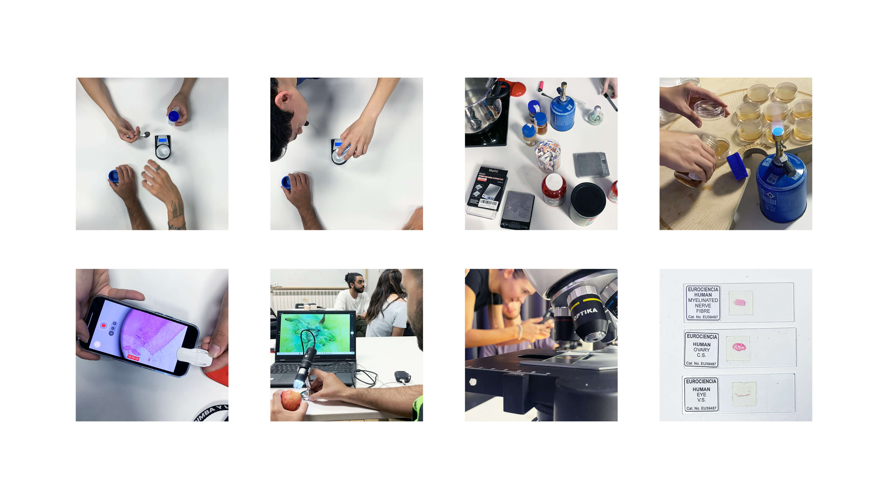

---
hide:
    - toc
---

# **BIO AGRI ZERO**

BIO ZERO

This week we were introduced to the basics of biology, synthetic biology and bio materials. Biology can be seen as the study of life and can be studied very broadly focusing on the whole planet or in very specific studies of for example microscopic structures like bacteria or DNA. 

We got an introduction to microbiology, the study of microorganisms, a diverse group of generally minute simple life-forms that include bacteria, archaea, algae, fungi, protozoa, and viruses. The field is concerned with the structure, function, and classification of such organisms and with ways of both exploiting and controlling their activities. 

Thereafter we made our own DIY laboratory and created an All Purpose Medium with simple ingredients that can be found in the local supermarket to grow and analyse living matter. We went hunting for bacteria and chose to take samples from the bathroom door handle and different fingerprints. This was placed in the incubator to later observe and analyse if or what kind of bacteria grows.

We learned the importance of labelling and sorting samples to know what is what and how it has been handled, taking notes on recipes, procedures, changes and time slots. We learned the procedure of using scientific methods to experiment.

