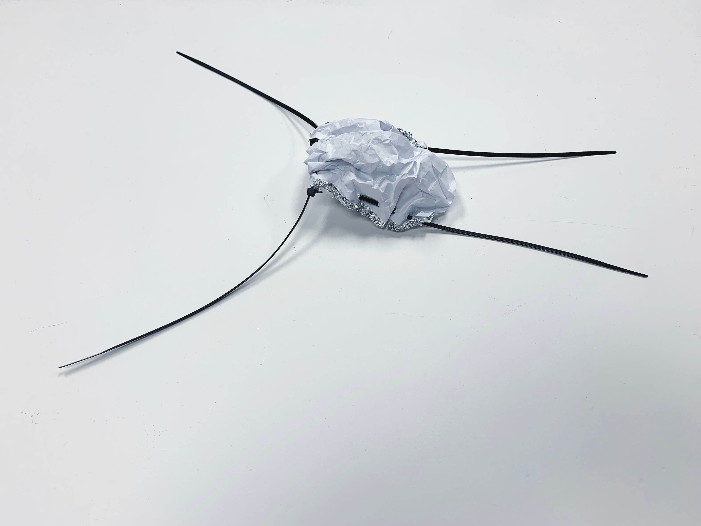
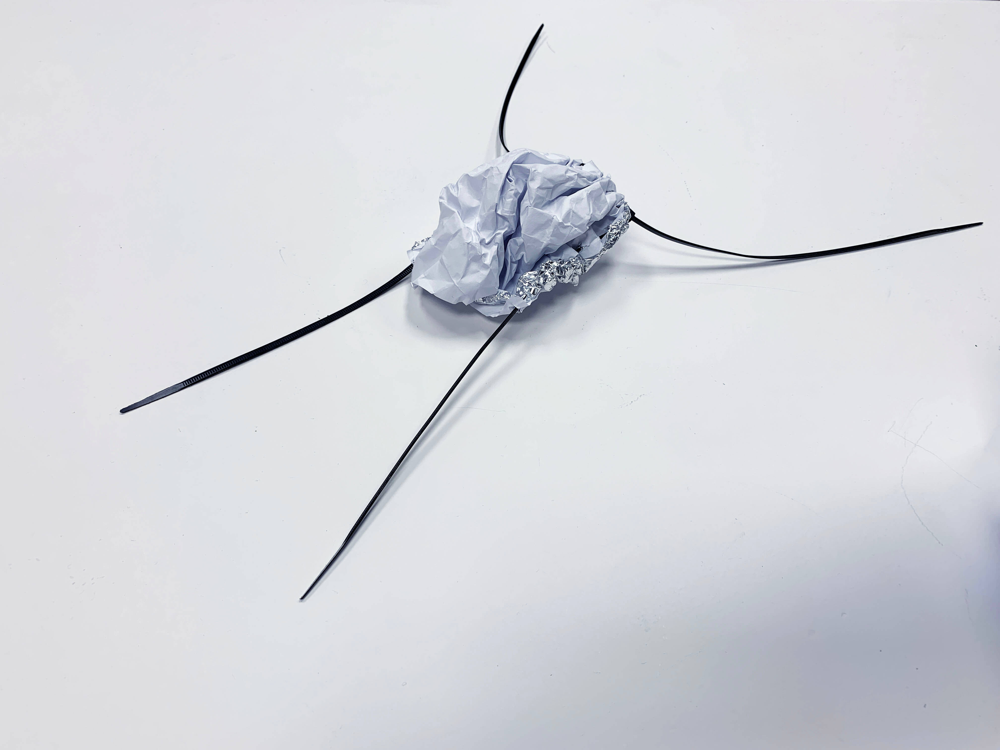
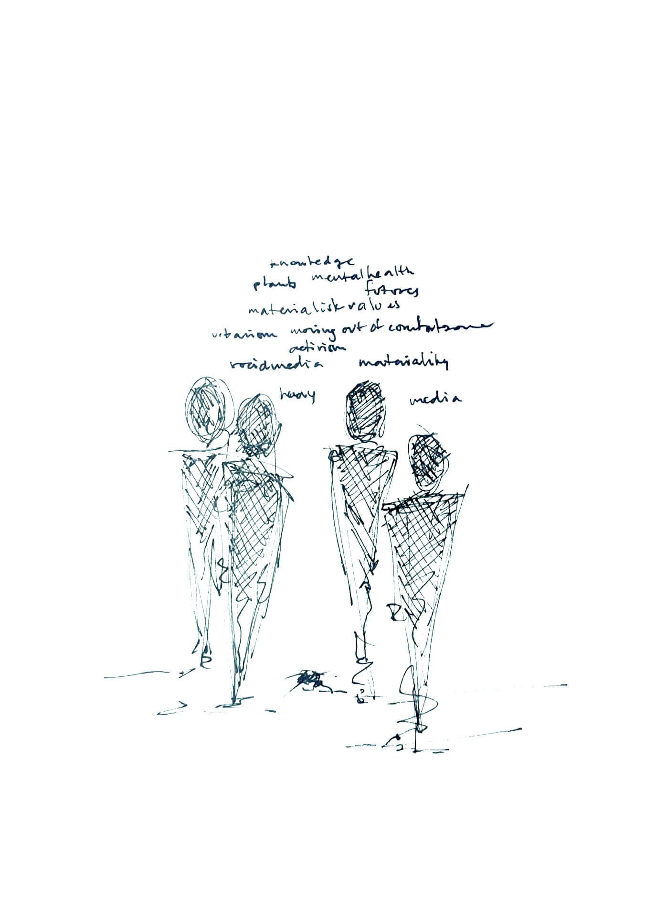
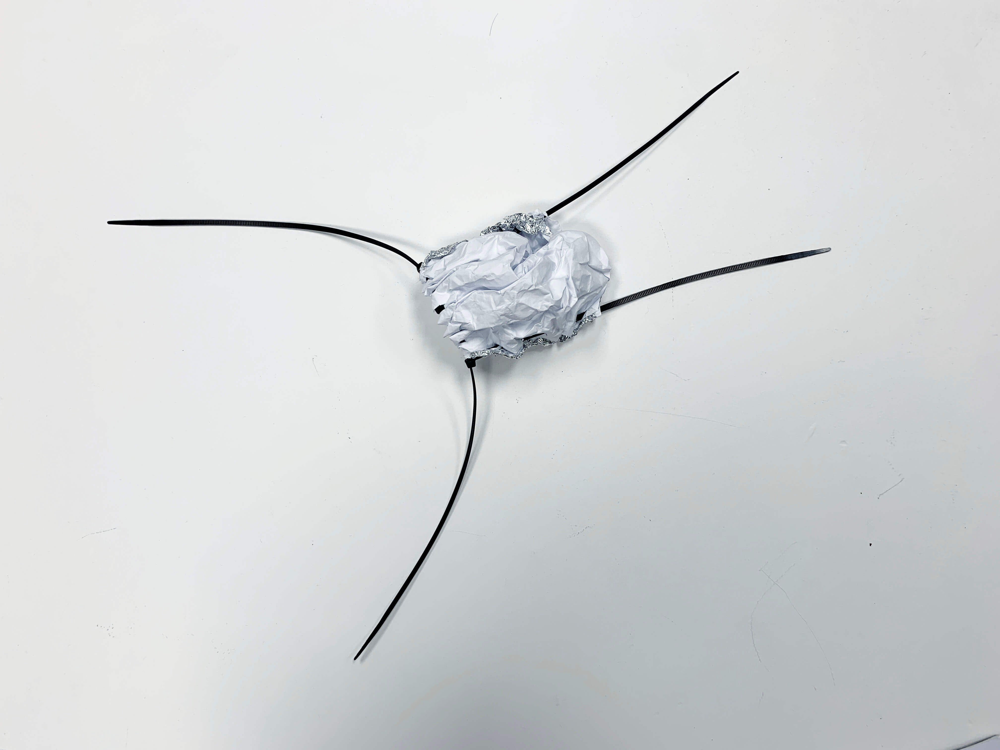
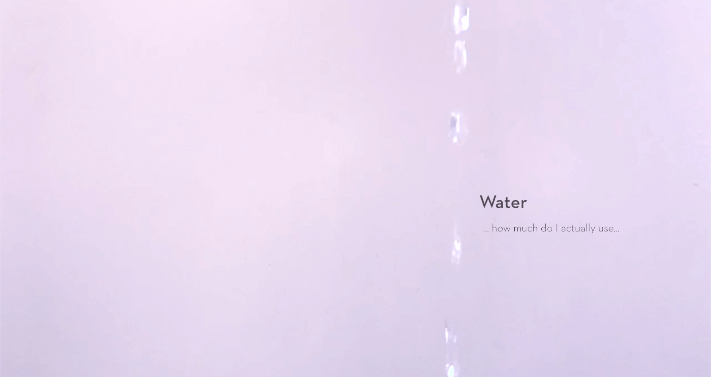
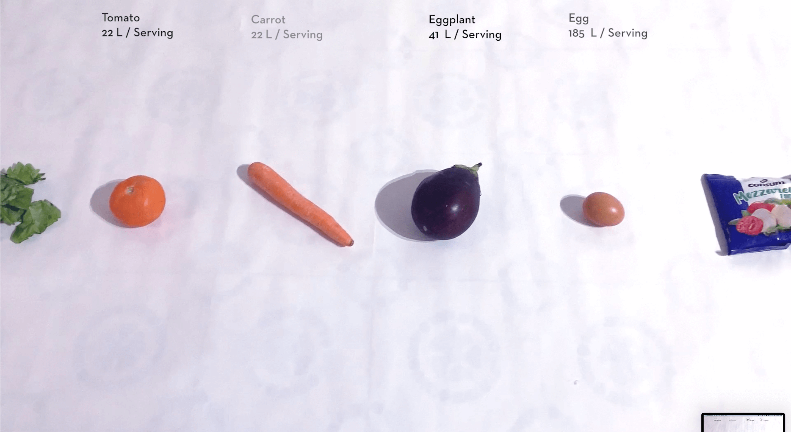
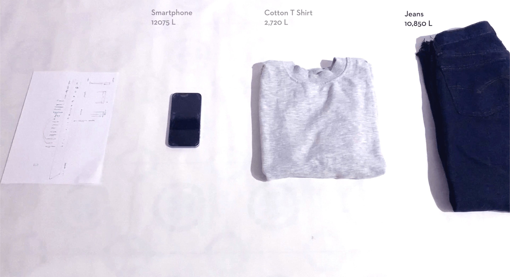
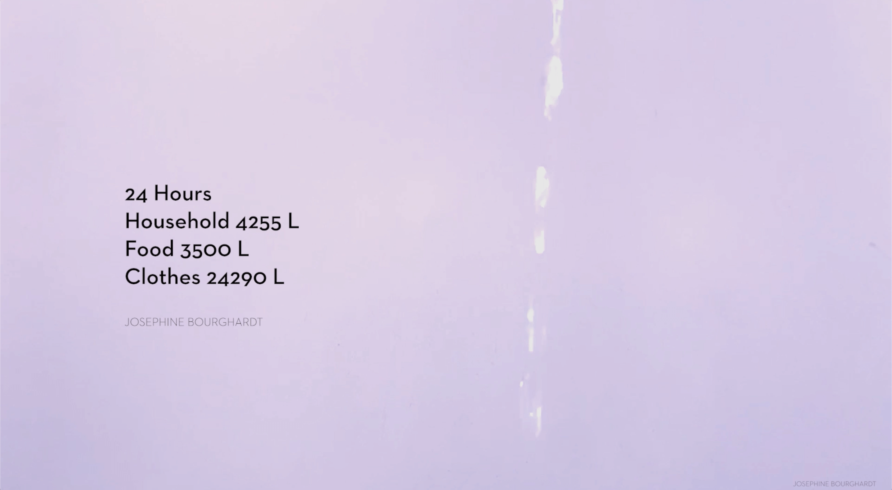

---
hide:
    - toc
---

# **LIVING WITH YOUR OWN IDEAS**

What does it mean to design from a 1st Person Perspective and to live with your ideas, immersing yourself personally to explore and generate an experimental understanding of subjects and the world around you. 

Usually when designing products the process starts with the technical parts, through a 1st Person Perspective the process starts with experiments and understanding the subject with your own body and everyday life, immersing ourselves in the user experience. 

In the exercise to introduce working from this perspective we started by making a ‘companion’ from waste and materials we had found. To not overthink the process of making this, we had only a couple of minutes to create something that we would be living with for 24 hours. 

__ GROW 

Growing with knowledge. How do we grow? Do we need specífic materialistic things to grow.. Do we plant a seed? What kind of seed? Plant a thought?

Does a physical object that has the possibility to save thoughts/ things make us more aware or selective of our surroundings and what we want to see/ know/ save? 

Does the perception and feeling of use change if the shape changes.. or the expression changes? 

What do we need to grow? To stay alive?

We will collaborate for 24 hours and help each other to find what we need to grow.

What happens when it grows in size, how does it affect me? 

A reflection of how things around us affect us, how objects and spaces take up space in our lives. How media takes space in our lives and follows us 24 hours a day. What do we actually want to save and carry?

24 hrs together
Through 24 hrs of spending time together this companion made me wonder and reflect on what it means to carry things around with us. Originally I thought I would want to save and store things in the companion that I find inspiring during the day, yet the opposite happened. I became very selective of what things I would consider carrying around because of the added weight it would include.  

It did however act as a great conversation starter of the impacts that our surroundings have on us, objects, spaces, media, mental health as some examples. The question of what is actually meaningful to the extent that you want to carry it with you, with the weight it brings. 

How do the surroundings and objects around us affect us and what weight do we carry with them? Do they weigh us down? How do thoughts and media affect us, when being connected to constant information flows, what follows us and do we actually choose to store this information or is it automatically stored? 

While reflecting on this, looking at this insect like object and imagining the body growing with things, you could visually see the legs becoming shorter and the body becoming heavier. Could this be a metaphor for the materialistic things we save and feel we need that the span and different directions we can reach with our ‘legs’ become shorter and we are weighed down by these 
things having a harder time to see things from other perspectives and move around in different spaces. The heavier you are the harder it can be to move and be flexible

Could the legs actually be growing the more knowledge you get, meaning that you reach even more places, situations and knowledge? All of this without weighing down our bodies? 

What would happen if the companion did the opposite? What would I put inside that I don’t want, and it would walk away with it?

Although I usually work in this way, using myself as a tool, living with the ideas to test, this exercise was another level of doing this, as I was now also aware of doing it. It allows a place to start and then allows insights and other things to emerge along the way, giving deeper value to the insights or understanding that there are other subjects underlying what you thought you should work with. 

In a second intervention I wanted to investigate water and consumption. Fresh water as a resource can for many, including myself, be taken for granted as unlimited and a s easy as opening a faucet to access. When moving to Barcelona this was questioned with the simple situation of drinking water that’s ‘drinkable’, but tasting very bad. Leading to the feeling of scarcity when water bottles are being emptied and the need to carry new ones up the stairs arise. 

Water is essential to all living things and access to fresh water should be a global right, yet in many parts of the world this is not the case where many people and living things are without access to freshwater. It made me wonder how much water I use daily and where this water comes from and how it’s handled. 

During 24 hours I started to track and map the water that I used. It started at home, saving excess water in containers to understand how much water is wasted when washing hands, showering or washing dishes and other things. Very early on during the experiment I realised that I would be needing a lot of containers as they filled up extremely fast. When this water became visible I became very aware of the huge amounts of water I use, I also became very aware that this is the waste water that I can see. I began to investigate how much water that I can’t see is used for the things that I don’t associate with water, tracking water usage for food, clothes and objects. 

The insight of how much water is used during everyday life was intense, and when adding the water usage used for clothes, food, products etc I was shocked. I reflected on how I could use less water and realised that the amounts I could actually influence where low in everyday life. The realisation of the systems that were living in, where we have no idea how things are actually managed. 

To extend the intervention I want to a predefined amount of water during a day, to investigate how I would distribute it and manage. I want to understand the challenges and reflections it could entail. Would I be able to live this way? Would I choose to live this way, needing to välja bort many of the things I take for granted in life, many things that I take for granted and think that I want.. Would other people do this? 

How could water usage be communicated so people understand and want to choose to do things differently. 

