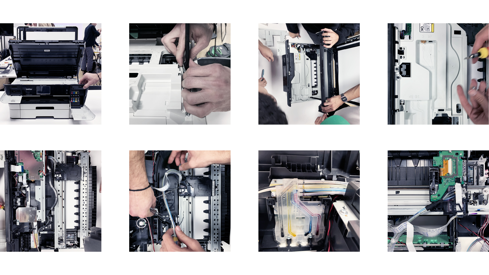
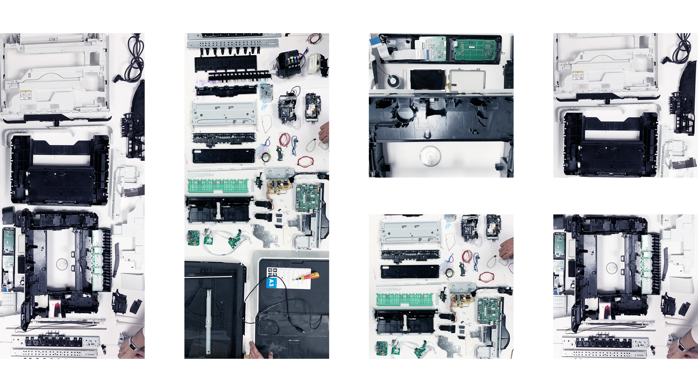
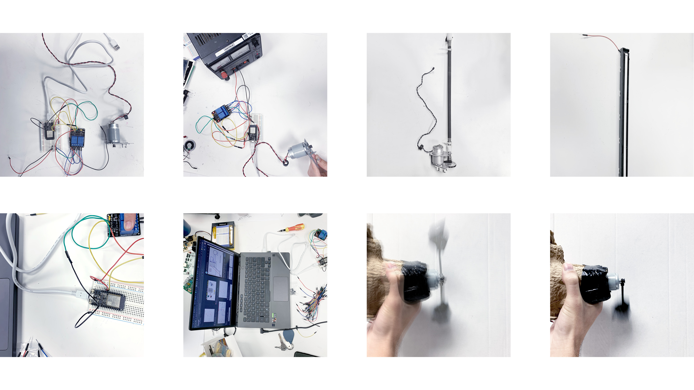
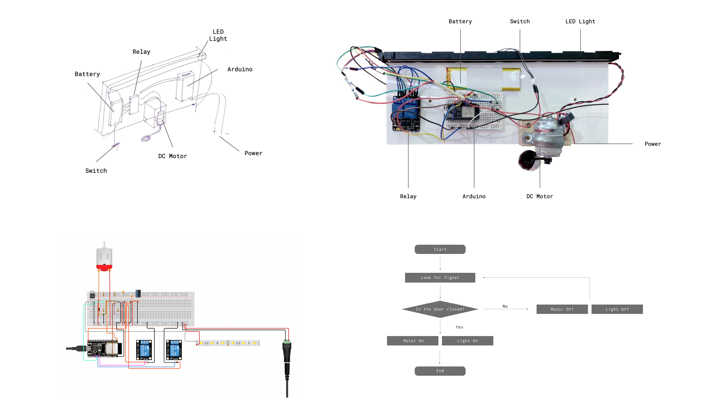
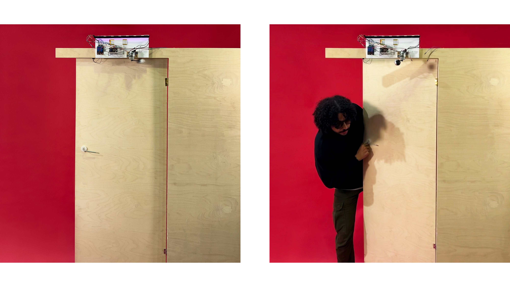

---
hide:
    - toc
---

# **TECH BEYOND THE MYTH**

Everyday we interact with objects and interfaces that have technologies that we don’t understand. The technology that we see today is mostly a black box that has little transparency of how it works and operates. How does technology shape our lives? How do we operate it and and how does it operate us? Do we have a critical relationship to the technology around us, do we know where and who it comes from and what information it collects and how this is used? 

The answer to most of these questions is - we don’t know - until we start taking back control of the technology around us and take action to owning our own products. We need to understand what it is we are using, how it affects us and the processes and systems around it.

Most products don’t have the possibility for consumers to manipulate or repair software or hardware. They are often hard or impossible to disassemble without breaking parts. Companies behind these products and services have many excuses to keep control of the things that we think that we own. It can be security excuses - that our products become insecure if we start disassembling and handling them ourselves, and that the warranty expires if we do. Companies might have their own repair systems, giving them full control of the product from purchase to return. We are supposed to agree to software that cannot be changed, agreeing to use products exactly as a company has chosen, meaning that they have actually just lent us the product and we are not free to use it as we like. This gives us no freedom or possibility to repair or know if the parts are faulty or preprogrammed to stop working. If we don’t ourselves understand how things work we have to trust the companies and systems around us, while they don’t trust us, and if we don’t have any knowledge about these products or systems we can’t doubt or question this trust. 

As products have gotten more difficult to understand and repair, a growing right-to-repair movement has been pushing for legislation that requires access to make information and repair tools available to users.

What impact does that have on society when things are hidden from us, who has the control when knowledge and information is hidden from us? 

During the first week of Tech Beyond the Myth we disassembled electronic products that no longer function to be able to understand the technology used and how things are built, as well as understand how they can be hacked and used in different ways. It is a way of understanding how we can take back control over the products around us. 

In a group of 5 we disassembled a Brother Inkjet Printer/ Scanner to understand the different parts and technologies it consists of. It is made up of two overall parts, one for scanning and one for printing. The top part consists of the image scan & fax scan and the bottom part consists of a printer and paper trays. The casing is made of different types of plastic, ABS (Acrylonitrile butadiene styrene) which has mechanical properties such as impact resistance, toughness, and rigidity, PS-HI (Polysterine high Impact) a hard, solid plastic used frequently in products requiring certain rigidity, whilst offering elasticity and a good capacity for absorbing impact, POM (Polyoxymethylene) which is used for precision parts requiring high stiffness, low friction, and excellent dimensional stability and PPE-PS (Polyphenylene Ether + Polystyrene) which is a ductile material with excellent hydrolytic stability, flame resistance, and UV resistance. These properties make it ideal for applications in the process engineering, electrical, and medical industries.

When looking at the inside of the case, it consists of several different mechanical and electronic parts with PC Boards, sensors and motors. The parts inside are made of different materials, there are parts in plastic, metal, rubber, wire and felt absorbers. 

Inkjet printers contain thousands of tiny holes that eject microscopic ink droplets onto the paper that passes through the printer. This process is performed at high speed with thousands of droplets ejected simultaneously resulting in the digital text or image transferred onto paper. MFC printers from Brother use a liquid ink produced either by a coloured dye or a liquid that contains solid pigments in suspension. Scanners work by shining light at a document. In simple terms, the reflected light is then directed onto photosensitive technology via mirrors and lenses, then converted into electronic data that is used to form a digital copy of the original.

The printer could be turned on and power supply to the unit was stable, although we couldn’t perform a ‘print or scan test’ to determine the actual issue. Upon lighting up, the screen displayed messages and the touchscreen could be interacted with, although showing an error message about connection to the server.

When disassembling there were no faulty or broken parts so we reflected on possible theories for failure. One possiblity could be the maintenance unit, which cleans the printing carriage and makes adjustments for precise printing. Having a faulty maintenance unit could imply incorrect ink supply to the carriage, where it could be supplying more or less ink than needed or no ink at all. The maintenance unit could also be full, something that could easily be changed, if it wasn't that it is so well packed inside the printer that changing or cleaning it means taking apart the whole printer. This could be prepogrammed to sell more printers instead of maintaining the one you already have. Other possible malfunctions could be the sensors, mechanical parts or the electronics inside. Again these parts could be repaired or replaced if it was not for how the printer is constructed and put together, where replacing separate parts inside the printer require the whole thing being disassembled. 

Disassembling the printer tells us a lot about how it is built and how it works, but it also tells us a lot about what the company manufacturing it wants. When identifying the complex systems within the printer and how it's constructed, it’s is interesting to understand how it can be so sold at such a low price? The ink cartridges all had chips, which could be used to communicate to the printer how much ink there is left for example, yet there was no sensor reading these chips. This could be to secure that customers only buy this specific ink for the printer to work. The biggest incomes for the company is usually the ink, so you could wonder if these chips are preprogrammed to be empty before they are to sell more ink for example? Can you hack these chips to use other types of ink?

The exercise helped remove fear of the ‘black box’, and learn how different aspects of technology work. By reverse engineering the printer we understood the complexity of a device that executes such simple tasks. A printer has complex integrated systems, components and technology almost as robust as a computer. It was also surprising to see the amount of parts and components and the complexity of processes and systems involved in printing or scanning. 

What is an almost useless machine? What can we do with the parts from the disassembled printer? How can we hack everyday products to use them in different ways? How can tinkering be used in the process to learn and understand things? 

By using different electronic parts from the printer, we started playing around with their use and function. The printer had two types of motors - Stepper motors and DC Motors, and several different types of sensors - Switch and Light sensors. 

The DC Motor was programmed with Arduino to have different speeds and change directions within different time slots. One of the DC motors we were using had a mechanical arm attached, when it started hitting the table while interacting with it we found the rhythm of the different sounds it could make exciting to investigate more. Through this different ideas of sound, light and behaviour emerged through the chaos/ process of playing. We started connecting other parts, making lights blink and switches connect humans with the machine. 

It became a rhythm machine, or a knocking machine, or just an almost useless machine. It can be a prank you place on someones door, that knocks aggressively until the door is opened, just to restart as it is closed again. Can that help people leave the house to go outside and enjoy nature, or is it a way to open doors and invite people  to be more social, removing boundaries? Or can it be seen as all the information that is constantly being thrown at us through media, telling us what to do, who to be, how to be it, not stopping until we actively choose to remove ourselves from society?

Can anything actually be useless or is there always a way to create value if we choose to? How can we use these electronics that were doomed useless and ready to be thrown away in other ways?

https://docs.google.com/presentation/d/18by7NvocWw5UwcJ9cJGmSISv-FKvB2dR-m_RdzmnwxE/edit?usp=sharing 

