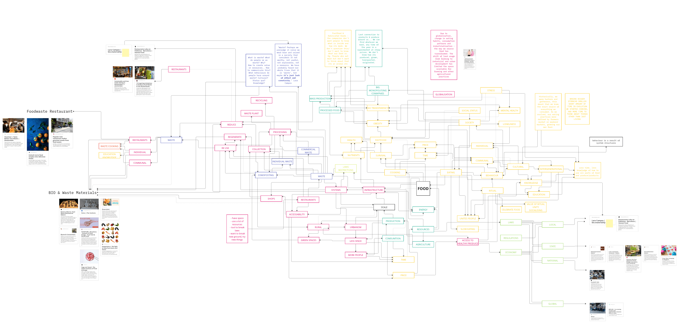
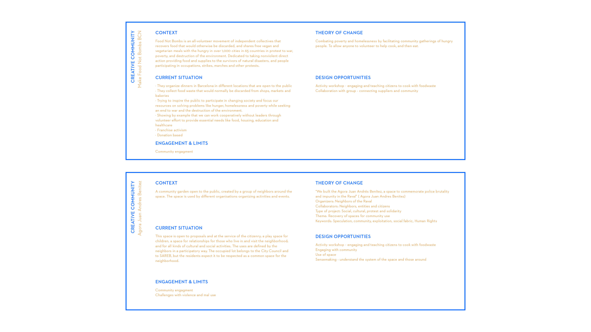
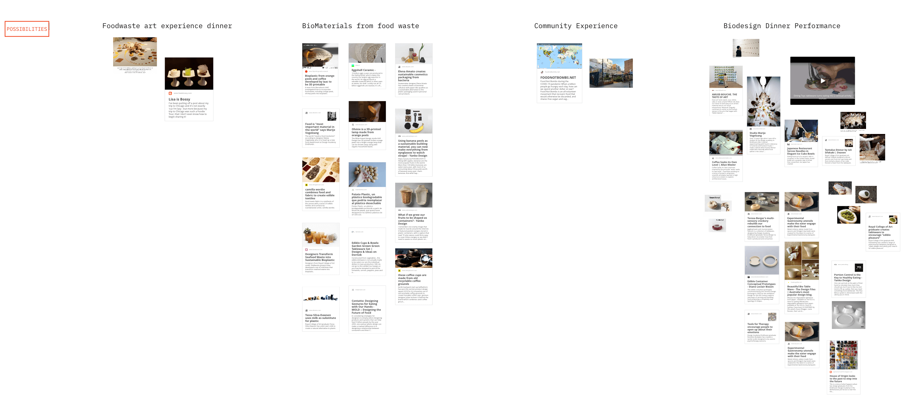
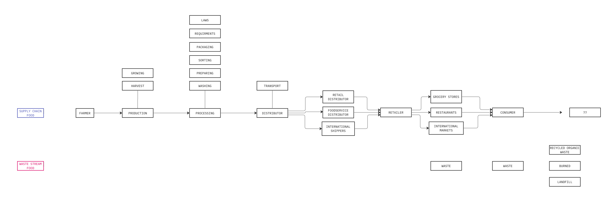

---
hide:
    - toc
---

# **COMMUNITY ENGAGEMENT**

During the past week we have been working with community engagement, understanding and learning about different tools to create local action-research projects with the goal of developing, testing, and implementing alternative and circular strategies towards a (more) locally productive and globally connected city. Those promoting participatory action-research believe that people have a universal right to participate in the production of knowledge which is a disciplined process of personal and social transformation. In this process, people rupture their existing attitudes of silence, accommodation and passivity, and gain confidence and abilities to alter unjust conditions and structures.

Design is changing. For many years design has been associated with the practice of problem solving to change situations into preferred ones and to how things ought to be by using rational and analytic techniques. But  who decides what ought to be and who’s preferred situations are being realised? And what happens when a problem has innumerable causes, the issue’s roots are complex and tangled, describing it is difficult and it changes with every attempt to address it and doesn’t have a right answer? 

The concept of wicked problems was proposed by Rittel and Webber in response to the then dominant rational problem-solving methodology. These types of problems are not receptive to standard analytical problem solving techniques and may even worsen situations by generating undesirable consequences. To approach and address the issues of todays society there is a need of fundamental change at every level that require new approaches to problem solving. It calls for new ways of designing that are based upon a deep understanding of how to design for change and transition within complex systems. There needs to be an understanding of the interconnectedness of social, economic, political and natural systems to address problems at all levels of spatiotemporal scale in ways that improve quality of life. 

Transition Design advocates the reconception of entire lifestyles, with the aim of making them more place-based, convivial and participatory and harmonising them with the natural environment. It focuses on the need for ‘cosmopolitan local- ism’, a lifestyle that is place-based and regional, yet global in its awareness and exchange of information and technology and argues that design has a key role to play in these transitions.

Transition designers view everyday life as a potentially powerful, transformative space to explore ways in which basic human needs are satisfied locally, within economies that exist to meet those needs. They draw on knowledge and wisdom from the past to conceive solutions in the present with future generations in mind. They study how large socio technical transitions have manifested throughout history and draw on the wisdom of pre-industrial indigenous societies who lived and designed sustainably in-place for generations (1).

So how do we engage with the system and communities? To understand wicked problems and how to work with systems change we have worked with different tools like enabling actions to map actors and resources, analysing local contexts, identifying potential synergies and opportunities, and amplifying key benefits for local stakeholders.

'Stop being blinded by the illusion of control, systems can’t be controlled, but they can be designed and redesigned.. We can expect surprises, learn from them and even profit from them. We can listen to what the system tells us, and discover how its properties and our values can work together to bring forth something much better than could ever be produced by our will alone. “We can’t control systems or figure them out. But we can dance with them!'  

An important part of working within systems and communities is to understand how they work and the value that is already there and to do that you have to become part of and work within it. Communicate and experiment ideas, and keep learning through trial and error.

Understand the behaviour in the community and pay attention to triggering events and outside influences that change or bring forward specific behaviours. Can these be changed from the outside? While looking at this its important to remember to zoom in and out of parts while still looking to maximise the system as a whole. The aim should be to enhance total systems properties, such as creativity, stability, diversity, resilience, and sustainability.

*“Before you disturb the system in any way, watch how it behaves. If it’s a piece of music or a whitewater rapid or a fluctuation in a commodity price, study its beat. If it’s a social system, watch it work. Learn its history.”* (2)

TOOLS · MAPPING

Through mapping systems and systems within systems the aim was to understand how things affect each other and where in these systems to intervene. 

Working in a group interested in waste streams, at the moment specifically food waste, we started mapping the subject and the systems that exist around us. Looking at the challenges, what already exists and how it has been worked with locally and globally. Now we wanted to understand ways of working with food waste in the systems around us. 

TOOLS · SENSEMAKING

Cognitive Psychologists Robert R. Hoffman, Gary Klein, and Brian M. Moon define sensemaking as "a motivated, continuous effort to understand connections (which can be among people, places and events) in order to anticipate their trajectories and act effectively" (Klein, Moon, & Hoffman, 2006).
A frame is an active perspective that both describes and perceptually changes a given situation

We make sense of complicated ideas by doing them, rather than studying them abstractly. The process of sensemaking is a process of learning that relies on and is subjectively dependant on the entire summation of knowledge, emotions, and prior experiences in the learner. This builds heavily on John Dewey's view of experience as being fundamental for education, and implies that learning (and the process of solving complicated problems) must be an active process, and is always a subjective process. 

Reframing is the act of purposefully shifting the normative frame, often temporarily or in multiple directions at once, in order to see things from a new perspective. Designers may be able to manage multiple frames (commonly including "their own", "the user's", and "the business's") and realize tradeoffs when various frames are given precedent (3). 

We had already done an intervention within the group cooking with the food waste that we had saved during 3 days. It was an event that helped us understand the situation of individual food waste from a first person perspective and the possibilities that can be created with it. I learned a lot of ways to use all parts of vegetables and new recipes. 

To continue this intervention we have been looking for local creative communities within the area of Raval, a diverse and multicultural neighbourhood in Cuitat Vella, where some of us also live. A couple different opportunities arised with people in our surroundings that were also interested in the subject, including creating an art dinner with food waste, collecting food waste from a restaurant to experiment with biomaterials and the community garden Agora Juan Andres, where we will also be attending a community dinner that is arranged by the organisation Create Food not Bombs.  

During this community dinner we will be helping out during the event, but we also want to connect with the community and organisation and engage in possibilities of collaboration. We will also be observing and understanding the area and connections within it. 

*”We are all actors: being a citizen is not living in society, it is changing it.”* 
- Augusto Boal

1 https://design.cmu.edu/sites/default/files/Transition_Design_Monograph_final.pdf 
2 https://donellameadows.org/dancing-with-systems/ 
3 https://www.jonkolko.com/writingSensemaking.php  

