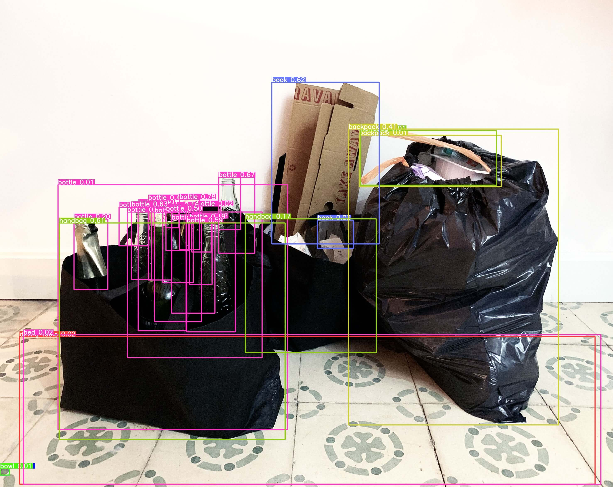
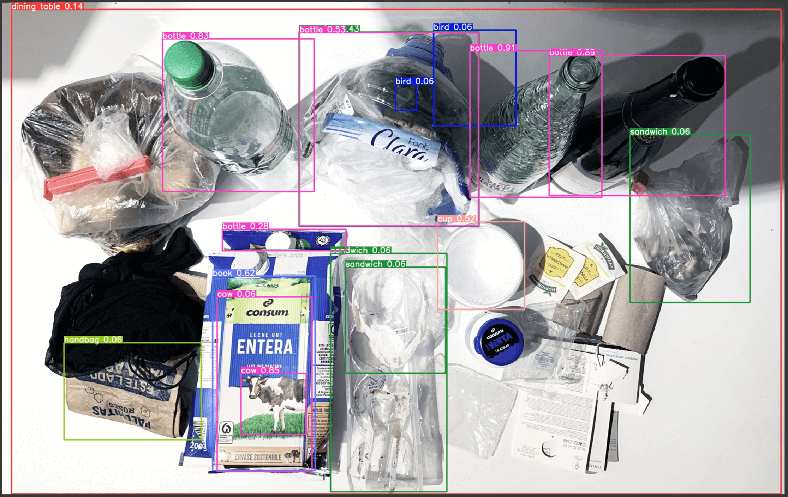
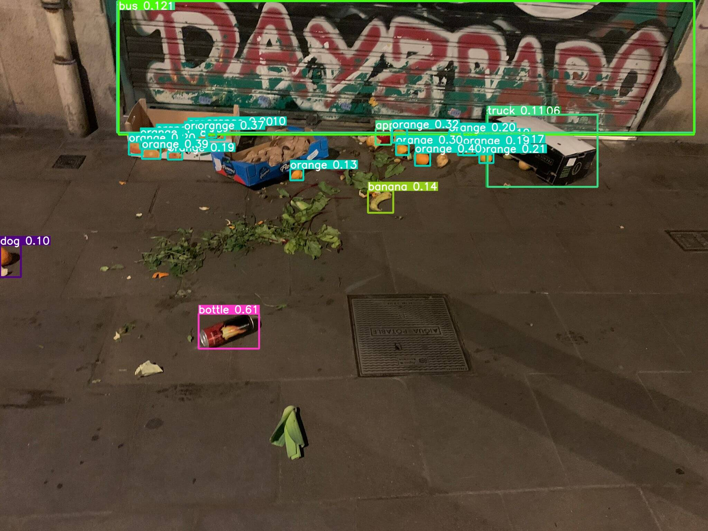
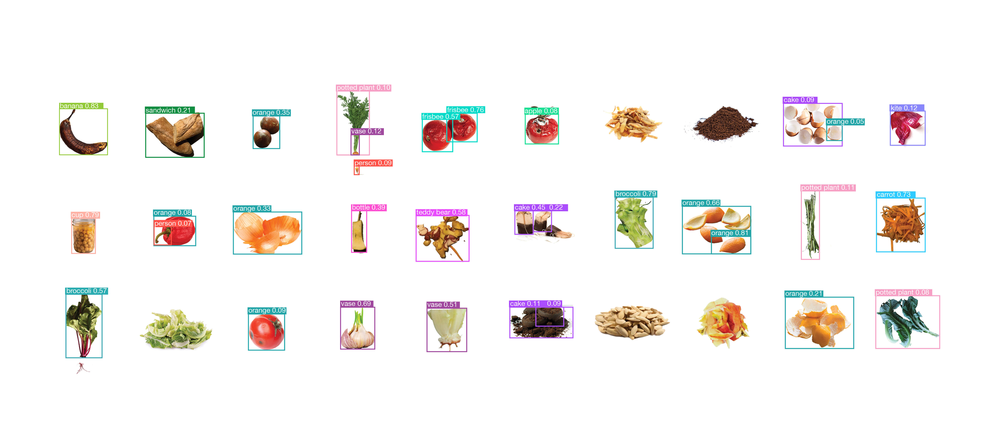

---
hide:
    - toc
---

# **EXTENDED INTELLIGENCES**
29.11.22- 09.12.22

During two weeks we have worked with Extended Intelligences to achieve an overall understanding of AI and Machine Intelligence, its tooling and ethics, and to gain knowledge in how to strategically construct applications which leverage and extend our own intelligence with that of machines.

What is intelligence? It can be defined in many ways, the capacity for abstraction, logic, understanding, self-awareness, learning, emotional knowledge, reasoning, planning, creativity, critical thinking, and problem-solving. More generally, it can be described as the ability to perceive information and retain it as knowledge to be applied towards adaptive behaviours within an environment or context.

Artificial intelligence is the simulation of human intelligence processes by machines, especially computer systems. The Oxford English Dictionary of Oxford University Press defines artificial intelligence as:
‘the theory and development of computer systems able to perform tasks that normally require human intelligence, such as visual perception, speech recognition, decision-making, and translation between languages.’ AI applications include expert systems, natural language processing, speech recognition and machine vision.

In general, AI systems work by ingesting large amounts of labeled training data, analysing the data for correlations and patterns, and using these patterns to make predictions about future states.
AI programming focuses on three cognitive skills: learning, reasoning and self-correction.
Learning processes. This aspect of AI programming focuses on acquiring data and creating rules for how to turn the data into actionable information. The rules, which are called algorithms, provide computing devices with step-by-step instructions for how to complete a specific task (1).

We were introduced to different AI tools and how AI embodied in art can be a communicative way to understand how it works and what you can do with it. Estampa showed us how they work and different models that they’ve developed and how we could use them. We used the … and analysed photos with the AI tool … that is trained to capture and illustrate what is represented in the photo. 

I analysed photos taken during the semester showing waste I had collected during a week and food waste found on the street, as well as scraps from vegetables. All things in the photos are things that we as humans regard as waste, yet the ‘machine’ did represent even one object in the photos as waste. It analysed the photos and communicated what it analysed exactly for what it is, materials and resources.

Can this tool help people understand what they see to understand objects as resources instead of waste? It is a very interesting tool that we’ll be using in the project I’m working on together with a group of students on the subject food waste.  

DREAMCATCHER · CRYSTAL FUTURES

During these weeks we have worked on a project with AI embodied as a Christal Ball that acts as a dreamcatcher and future teller. 

It retrieves peoples dreams through scanning brain activity and translating it into images, encrypts them and analyses the network of all peoples collective dreams to create individual predictions of the future. It is embodied as a Chrystal ball that is owned personally and can be engaged with through text or voice recognition, where you can ask it questions about the future and it will predict individualised responses in the form of images. 

Although a speculative project, it might not be farfetched from what could be reality in the future. There are already apps and projects working with AI to analyse dreams and there meanings, as well as projects working with scanning brain activity through fMRI, which is a neural decoding approach in which machine-learning models predict the contents of visual imagery during the sleep-onset period, given measured brain activity, by discovering links between human functional magnetic resonance imaging patterns and verbal reports with the assistance of lexical and image databases (2). Other projects are researching and experimenting with methods to incubate dreams serving as tools for education for enhanced learning, creativity and memory for example. Media Lab’s Fluid Interfaces group calls this method “Targeted Dream Incubation” (TDI). ‘This protocol, implemented through an app in conjunction with a wearable sleep-tracking sensor device, not only helps record dream reports, but also guides dreams toward particular themes by repeating targeted information at sleep onset, thereby enabling incorporation of this information into dream content’ (3).

This research points to the possibility of these functions being a reality in the future, which calls for understanding the ethics in collecting and manipulating peoples dreams. Who will have access to this technology and information? If the collective dream dataset is hacked - what unethical uses could it be applied to? Could marketing technologies become even more powerful? If you can read the innermost fears and desires of a population, how well can you manipulate it?

This project can be seen as an embodiment questioning some of these questions and thoughts to create conversations. 

(1) (https://www.techtarget.com/searchenterpriseai/definition/AI-Artificial-Intelligence)
(2) (https://www.science.org/doi/10.1126/science.1234330)
(3) https://in.mashable.com/science/16056/mit-researchers-develop-a-way-to-record-and-even-alter-dreams
