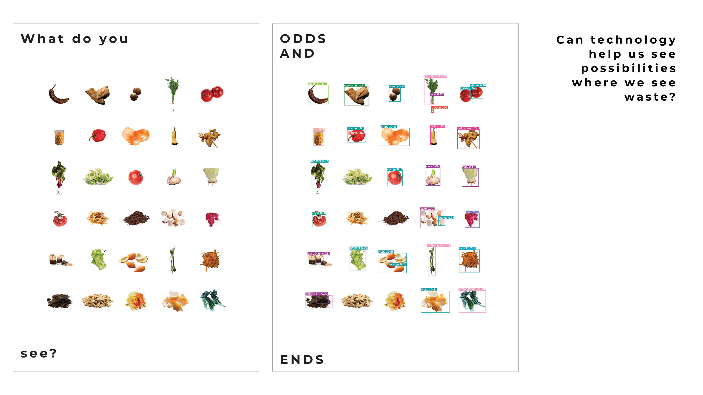

---
hide:
    - toc
---

# **EXPLORATIONS**

Different explorations during the term leading to interventions.

Cooking with waste intervention with the group
Within a group of classmates interested in waste streams we have been exploring the topic of food waste. We organised a dinner together, where we saved foodwaste for 3 days which we then used to cook a dinner with together. It was a great experience where we learned new ways of using all parts of vegetables and rest products in other ways, things we would've otherwise have thrown away.  

Can technology help us see possibilities where we see waste? Can AI be used as a tool to see waste from new perspectives?

During the course Extended Intelligences we used the AI model YOLO9000 from Studio Estampa. It is a trained object recognition neuronal network with a dataset of 9,418 words and millions of images. It is one of the many artificial vision tools being developed, designed for automatic image annotation. that analyses contents in photos and labels them (tallerestampa.com, n.d). We used this model to anlayze photos of waste and vegetable scraps - things that are usually disgarded as waste. 

In the photos the AI model did not mention waste, trash or scraps for anything. It accuratly labeled many of the objects in the photos, although some were comic responses. This was very interesting as we as humans are many times quick to judge things as waste.

We wanted to investigate what people saw in the photos and compare it to what the AI model saw. We did this at the event about food waste at the restaurant El Doble and at Design Dialogues. Many people described what they saw and the posters sparked discussions and reflections on waste reduction. It’s interesting to consider whether people’s responses were influenced by the theme of the project or if they genuinely saw more possibilities in the photos beyond their initial appearances as waste. In any case, any type of positive reflection or thought that promotes waste reduction is a positive outcome. 

We also used the openai ChatGPT to ask questions about waste and resources. 

<iframe width="560" height="315" src="https://www.youtube.com/embed/4GvadeXuzXQ" title="YouTube video player" frameborder="0" allow="accelerometer; autoplay; clipboard-write; encrypted-media; gyroscope; picture-in-picture" allowfullscreen></iframe> 
