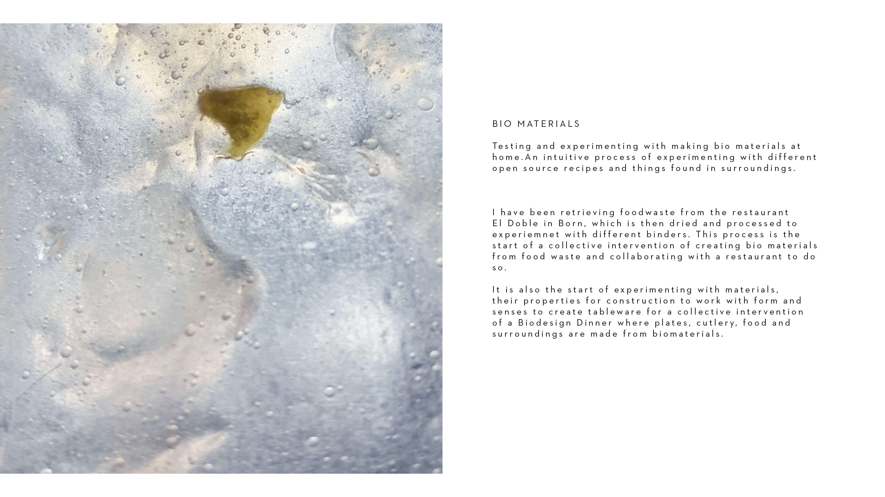
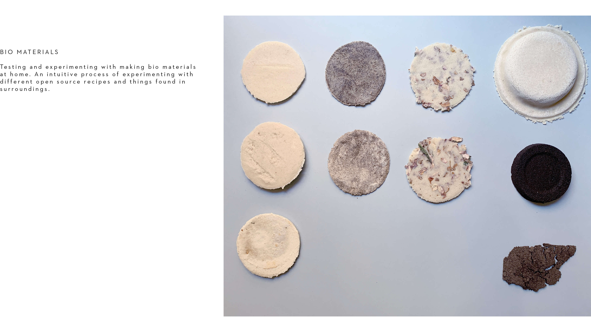
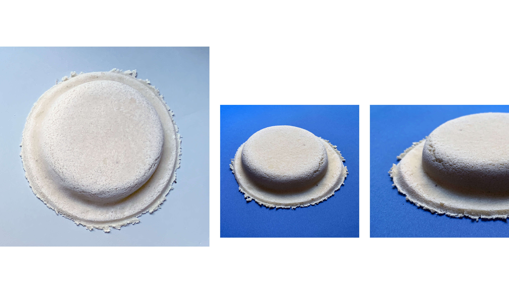

---
hide:
    - toc
---

# **EXPLORATIONS**

Different explorations during the term leading to interventions.

Cooking with waste intervention with the group
Within a group of classmates interested in waste streams we have been exploring the topic of food waste. We organised a dinner together, where we saved foodwaste for 3 days which we then used to cook a dinner with together. It was a great experience where we learned new ways of using all parts of vegetables and rest products in other ways, things we would've otherwise have thrown away.  

