---
hide:
    - toc
---

# **INTERVENTIONS**

Throughout the term I have been working in a group together with four others about Hacking Supply Chains. It all started where we found that we had similar interests and started working togethere to find out more about this subject. During this term the channel has been food waste. Over 30% of food is lost or wasted each year. A striking number, given the large amount of hungry people in the world. Wasted food is not only inefficient, it’s a social justice issue.

Food is at the centre of people’s needs linking everything and everyone. 

Food is fuel, it is energy, it shapes our identity, food connects people, food can bring comfort, confer status, and heal. We will always need food and it will therfor always be relevant. 

The subject of food is increasingly urgent across the globe. Food production contributes to more than 25% of global emissions. Each year around 70% of fresh water is used by agriculture, exhausting and contaminating water sources because of inefficient and excessive use. 42% food is wasted every year only by consumers.

In a time of exploition, overconsumption, declines in insect populations, animal welfare, obesity etc we are working with the subject of food, food production, perceptions of food, and consumption. 

How can we change the perception we have of food and waste? How can we visualise and show the possibilities of the resources that it actually is?
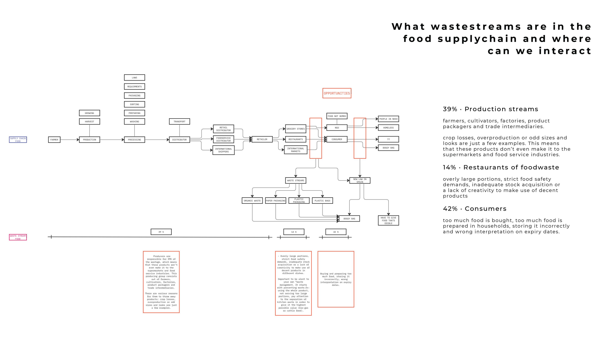

// An experience to understand your direction through embodied action

Cooking with food waste intervention within group
Within a group of classmates interested in waste streams we have been exploring the topic of food waste. We organised a dinner together, where we saved foodwaste for 3 days which we then used to cook a dinner with together. It was a great experience where we learned new ways of using all parts of vegetables and rest products in other ways, things we would’ve otherwise have thrown away. 

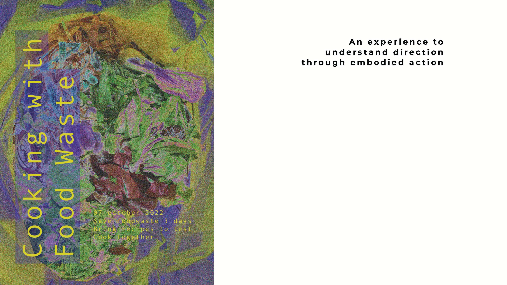
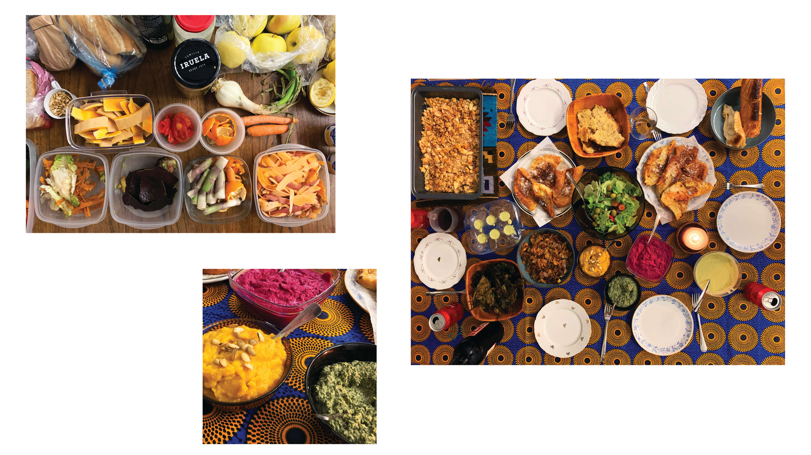

// An experience to understand your direction through embodied action // An experience to learn with and from others // An action to build trust

FOOD NOT BOMBS

28.11.22
AGORA Juan Andres Benitez · Food Not Bombs Dinner
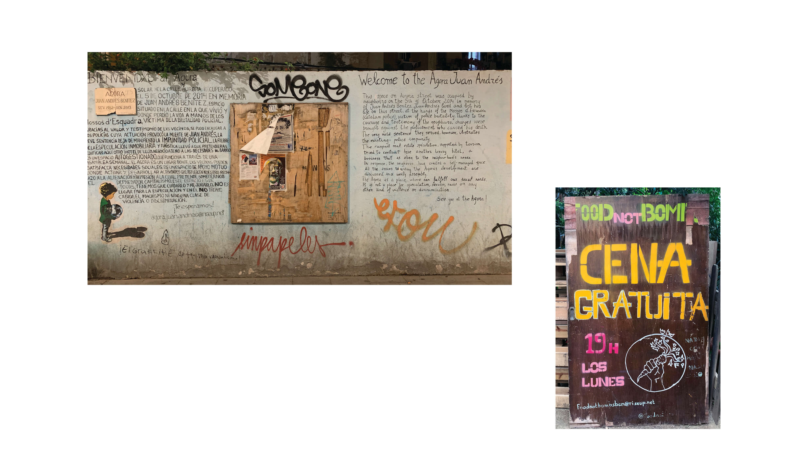
They pick up vegetables and food at Veritas that would otherwise be thrown away. Food Not Bombs can pick up food on Fridays & Mondays. The other days other NGOs pick up the food waste.
// Are there other shops that we can connect FNB with? Or other shops that are not giving food away, that we can connect with other organisations so that all shops give away the food?

There were 5 people working for FnB when we were there, they go to Agora Communal Garden and cook food with the vegetables they’ve picked up that they then serve for free.

The people that were in the community garden were mostly people that live in the neighbourhood and use the garden regularly. FnB wants to serve food to homeless, but food is not a very big problem for homeless in Bcn, its mostly shelter and care, and they will accept the food if its given to them but they don’t come to the community garden. They also have the problem of not having containers to give away the rest of the food in.

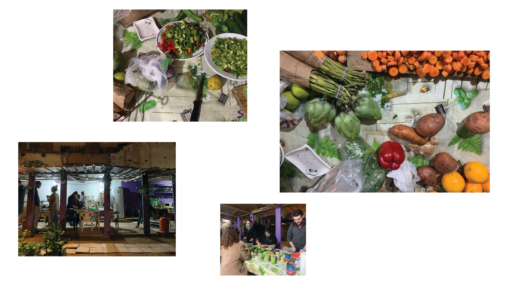

// Can the community in the garden be a part of producing doggybags? they can bring the food home, or bring it to people in the neighbourhood that they know need it?

// Could we connect the people that are using the garden to participate in the cooking process? Could FnB bring produce and they in the end cook together and for their own community and FnB can focus energy on other places and/or subjects?

// Open source formpress to press doggybags from everyday materials/waste. Can be transferred to restaurants etc later

// Connect FnB with other places where they can do the dinners, where they can connect to a bigger community? People who need it more? Who would need it more?

// Collective effort to make doggy bags

// Collective efforts to cook together

BIO MATERIALS

‘Materials on their own are not regenerative as such, but the way that we work with them and methods that we use can be regenerative.’ - Elsa Dagný Ásgeirsdóttir, Lead Creative Producer, SPACE10
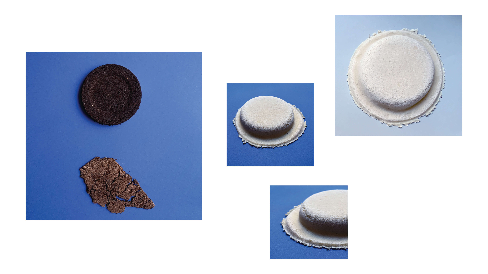

By using the language of materials for social and environmental reparation, we explore how different approaches to sustainable, circular, and regenerative design could redefine our relationships with materials, the land, and each other. 

Through exploring surrounding communities and contacts we’ve been connecting with different restaurants and cafes to collect food waste. Collecting general food waste from the restaurant El doble in Born to experiment with how to use unsorted waste and what you can do with it. We have been collecting coffee grounds from the cafe Itnic in Poble Nou and eggshells from Brunch in Raval. 

These different waste streams have been collected to investigate and explore what these materials might be on a small scale and if they could be viable solutions for a better everyday life. What are the opportunities for materials to weave in ancestral knowledge, improve people-planet relationships, and enable a shift beyond human-centered design? Can we repair our local environments by designing with materials that are in symbiosis with the places we live?

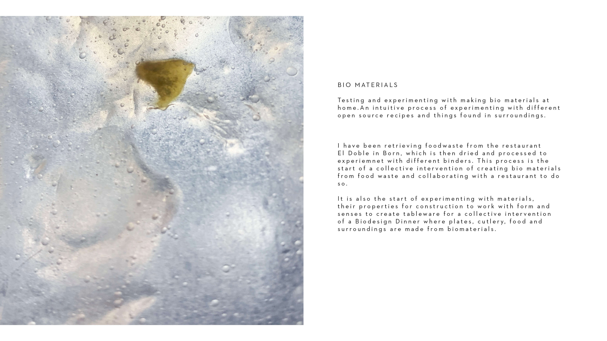
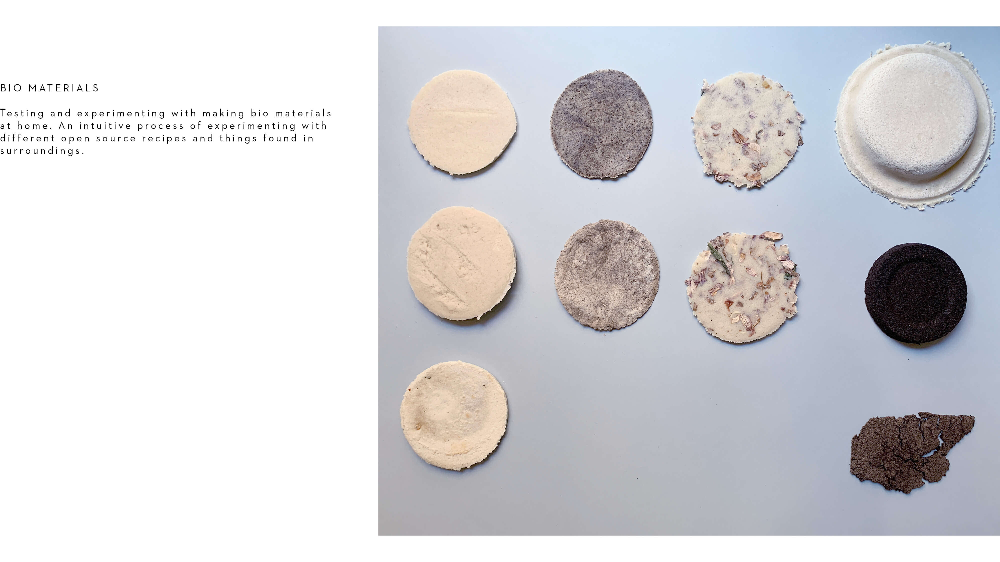
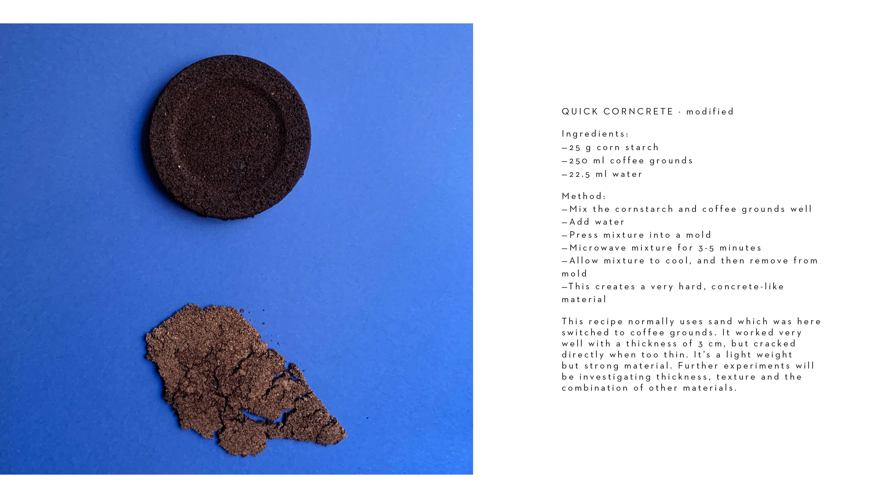
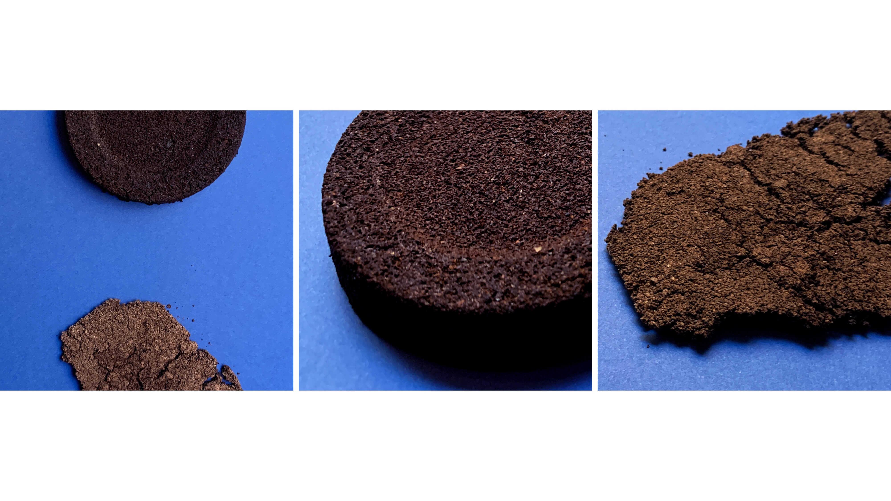
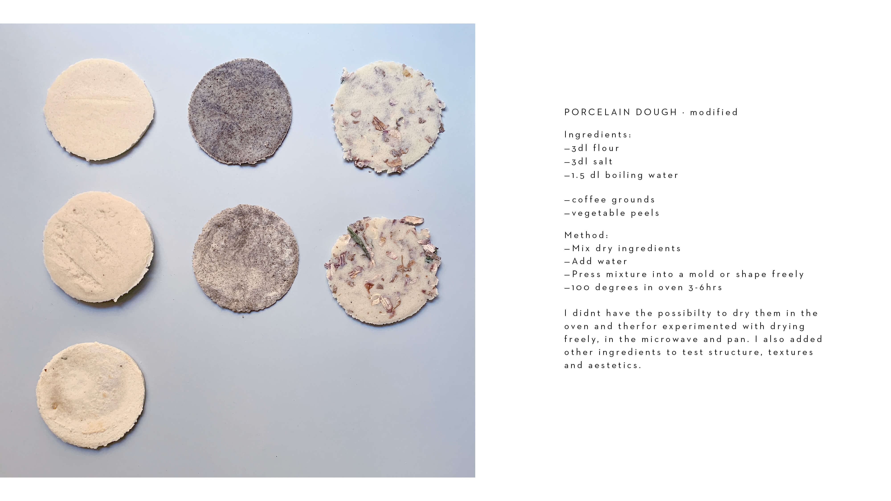
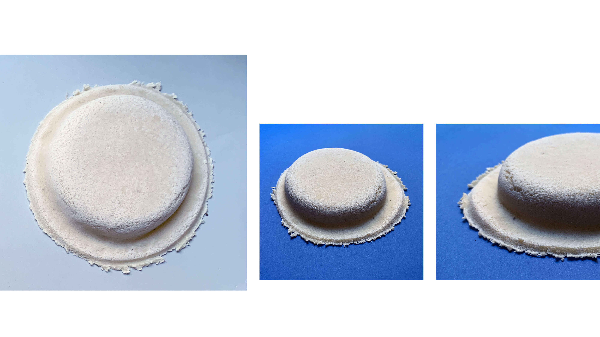

// A group activity tobring difficult topics to the table.

From the interactions with the restuarant El Doble where waste has been collected to experiment with Bio Materials, we started discussing how to communicate the topic of food waste, how it can be reduced and how it can be used. This led to a collaboration with the restaurant where we had an event bringing up the topic through communicative and interactive posters and the resturant serving a special dish on the menu made only from the vegetable scraps that they would otherwise through away. 

The evening showed that many people were interested in the topic of waste, discussing the meaning of the word waste and how people perceive it became a great way to interact and learn from eachother. The dish that the restaurant made was beautifully served and presented helping to add value to what would otherwise be disgarded. 
