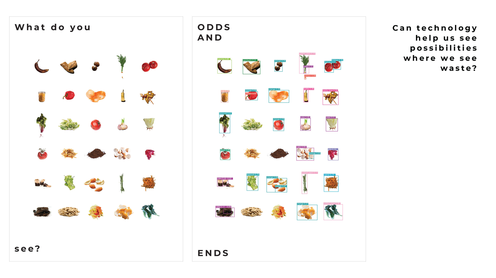

---
hide:
    - toc
---

# **INTERVENTIONS**

Throughout the first term I've been working with four others in a group focusing on Hacking Supply Chains. It all started with these similar interests intersecting in the subject of food waste which became a channel in this term to work with supply chain.

Food is at the centre of people’s needs linking everything and everyone. Food is fuel, it is energy, it shapes our identity, food connects people, food can bring comfort, confer status, and heal. We will always need food and it will therfor always be relevant. 

The subject of food is increasingly urgent across the globe. Food production contributes to more than 25% of global emissions. Each year around 70% of fresh water is used by agriculture, exhausting and contaminating water sources because of inefficient and excessive use. 42% food is wasted every year only by consumers. 

In a time of exploition, overconsumption, declines in insect populations, animal welfare, obesity and hunger we are worked with the subject of food, food production, perceptions of food, and consumption. Investigating how to change perceptions of food and waste, how to visualise and show the possibilities of waste being resources. We started this by investigating ourselves and licing with the idea of food waste. 

Cooking with food waste
// An experience to understand your direction through embodied action

Within a group of classmates interested in waste streams we have been exploring the topic of food waste. We organised a dinner together, where we saved foodwaste for 3 days which we then used to cook a dinner with together. It was a great experience where we learned new ways of using all parts of vegetables and rest products in other ways, things we would’ve otherwise have thrown away. 

From starting with an intervention from a first person perspective to understand the subject of food waste and the possibilities of using it in different ways we continued to work with other interventions that arose in the process from experiences, conversations, observations and feedback. 

We wanted to understand and learn how to eliminate the concept of waste and to instead show how disgarded food has value and have been working with this from different perspectives and targetgroups. 

FOOD NOT BOMBS
AGORA Juan Andres Benitez 
Claudia Bertlotti  // Josephine Bourghardt // June Bascaran // Sami Piercy // Seher Krishna

// An experience to understand your direction through embodied action // An experience to learn with and from others // An action to build trust

They pick up vegetables and food at Veritas that would otherwise be thrown away. Food Not Bombs can pick up food on Fridays & Mondays. The other days other NGOs pick up the food waste.
// Are there other shops that we can connect FNB with? Or other shops that are not giving food away, that we can connect with other organisations so that all shops give away the food?

There were 5 people working for FnB when we were there, they go to Agora Communal Garden and cook food with the vegetables they’ve picked up that they then serve for free.

The people that were in the community garden were mostly people that live in the neighbourhood and use the garden regularly. FnB wants to serve food to homeless, but food is not a very big problem for homeless in Bcn, its mostly shelter and care, and they will accept the food if its given to them but they don’t come to the community garden. They also have the problem of not having containers to give away the rest of the food in.

// Can the community in the garden be a part of producing doggybags? they can bring the food home, or bring it to people in the neighbourhood that they know need it?

// Could we connect the people that are using the garden to participate in the cooking process? Could FnB bring produce and they in the end cook together and for their own community and FnB can focus energy on other places and/or subjects?

// Open source formpress to press doggybags from everyday materials/waste. Can be transferred to restaurants etc later

// Connect FnB with other places where they can do the dinners, where they can connect to a bigger community? People who need it more? Who would need it more?

// Collective effort to make doggy bags

// Collective efforts to cook together

BIO MATERIALS

‘Materials on their own are not regenerative as such, but the way that we work with them and methods that we use can be regenerative.’ - Elsa Dagný Ásgeirsdóttir, Lead Creative Producer, SPACE10

By using the language of materials for social and environmental reparation, we explore how different approaches to sustainable, circular, and regenerative design could redefine our relationships with materials, the land, and each other. 

Through exploring surrounding communities and contacts we’ve been connecting with different restaurants and cafes to collect food waste. Collecting general food waste from the restaurant El doble in Born to experiment with how to use unsorted waste and what you can do with it. We have been collecting coffee grounds from the cafe Itnic in Poble Nou and eggshells from Brunch in Raval. 

These different waste streams have been collected to investigate and explore what these materials might be on a small scale and if they could be viable solutions for a better everyday life. What are the opportunities for materials to weave in ancestral knowledge, improve people-planet relationships, and enable a shift beyond human-centered design? Can we repair our local environments by designing with materials that are in symbiosis with the places we live?

// A group activity to bring difficult topics to the table.
FOOD WASTE EVENT · EL DOBLE 
Claudia Bertlotti  // Josephine Bourghardt // June Bascaran // Sami Piercy // Seher Krishna

From the interactions with the restuarant El Doble where waste has been collected to experiment with Bio Materials, we started discussing how to communicate the topic of food waste, how it can be reduced and how it can be used. This led to a collaboration with the restaurant where we had an event bringing up the topic through communicative and interactive posters and the resturant serving a special dish on the menu made only from the vegetable scraps that they would otherwise through away. 

The evening showed that many people were interested in the topic of waste, discussing the meaning of the word waste and how people perceive it became a great way to interact and learn from eachother. The dish that the restaurant made was beautifully served and presented helping to add value to what would otherwise be disgarded. 

Can technology help us see possibilities where we see waste? Can AI be used as a tool to see waste from new perspectives?

During the course Extended Intelligences we used the AI model YOLO9000 from Studio Estampa. It is a trained object recognition neuronal network with a dataset of 9,418 words and millions of images. It is one of the many artificial vision tools being developed, designed for automatic image annotation. that analyses contents in photos and labels them (tallerestampa.com, n.d). We used this model to anlayze photos of waste and vegetable scraps - things that are usually disgarded as waste. 

In the photos the AI model did not mention waste, trash or scraps for anything. It accuratly labeled many of the objects in the photos, although some were comic responses. This was very interesting as we as humans are many times quick to judge things as waste.

We wanted to investigate what people saw in the photos and compare it to what the AI model saw. We did this at the event about food waste at the restaurant El Doble and at Design Dialogues. Many people described what they saw and the posters sparked discussions and reflections on waste reduction. It’s interesting to consider whether people’s responses were influenced by the theme of the project or if they genuinely saw more possibilities in the photos beyond their initial appearances as waste. In any case, any type of positive reflection or thought that promotes waste reduction is a positive outcome. 

We also used the openai ChatGPT to ask questions about waste and resources. 

<iframe width="560" height="315" src="https://www.youtube.com/embed/4GvadeXuzXQ" title="YouTube video player" frameborder="0" allow="accelerometer; autoplay; clipboard-write; encrypted-media; gyroscope; picture-in-picture" allowfullscreen></iframe> 

BIO DESIGN DINNERS
Claudia Bertlotti  // Josephine Bourghardt // June Bascaran // Paige Perillat

A dinner where the tableware and food courses are made of the same ingredients with a special focus on food waste and biodesigned species. The dinner will also include a performative/ritual aspect as a playful prompt to ink the experience in memory and as a springboard for critical conversation. 

Foodwaste, Biomaterials, Biodesign. These are all subjects that might feel inaccesible or heavy to most. With such an experience we hope to tackle these subjetcs in a playful, embodied way so participants leave the dinner with a tangible sense of what’s possible with these subjects, and inspired to create themselves.

We displayed this project during Design Dialogues to get feedback of the concept and objects that we’ve reached so far. We received lots of positive feedback and tips on how we could continue the work. 

DESIGN DIALOGUES

ODDS & ENDS
noun [ plural ]   informal
UK  /ˌ  odz ənd ˈendz/ US  /ˌo:dz ənd ˈendz/
(UK also odds and sods)
 
C2
various things of different types, usually small and not important, or of little value

noun [ plural ]
in British English
miscellaneous items or articles 
in American English
scraps; remnants; oddments

noun 
a motley assortment of things

Through exhibiting the processes we’ve been working with at Design Dialogues we had the opportunity to communicate what we’ve been working on the last weeks of the first term of MDEF. Through discussions with visitors we got helpful feedback, resources and contacts to further develope the project. The name Odds & Ends describes the process and work we did working with different things that would usually be seen as little value.

