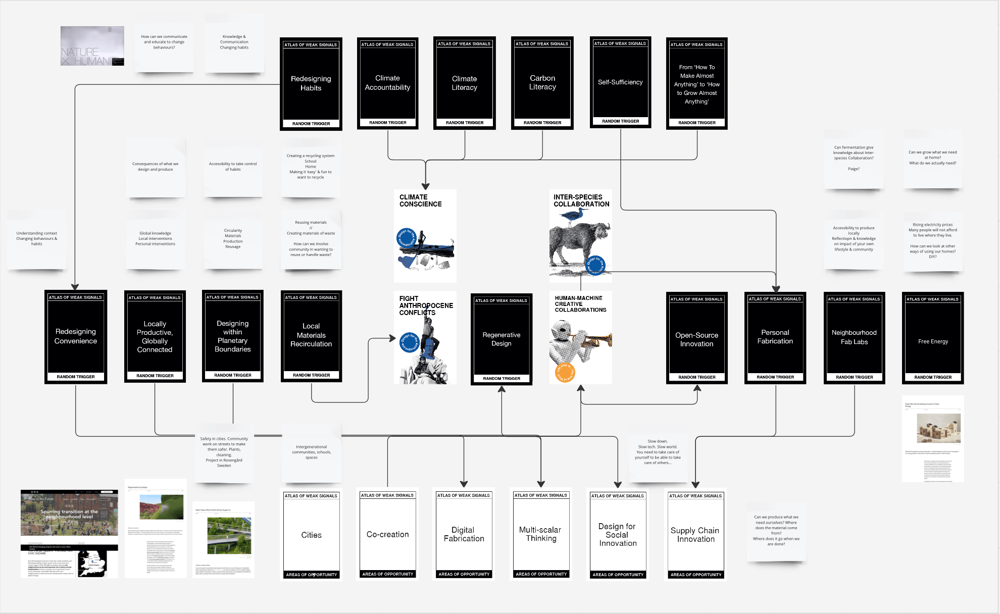
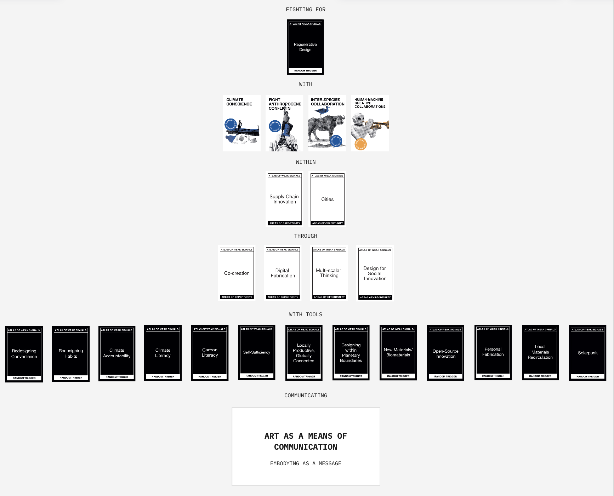

---
hide:
    - toc
---

# **STUDIO II**

The first term involved a lot of feelings of being lost, trying to understand what subjects interest me, letting go of control and learning and moving forward by doing. Keeping an open mind and accepting the feeling of being lost were two of the most useful insights during the first term. By letting go of trying to control what we were gonna do and with who and how it would look and act etc, letting go became fuel for the project where lots of new contacts were made, and new opportunities arose. The term was compact with different courses that helped explore subjects from different perspectives. During the term I have personally worked on understanding my passions, communicating what I am good at within a group and practicing to communicate projects and thoughts verbally with contacts to find opportunities of intervention. 

The interventions that we did during the first term were a good way to use different channels and target groups to understand the subject from a broader perspective. Due to the time restrictions the interventions were lacking in depth and true time for deeper collaborations with communities. We had a thought of being able to connect on a deeper level with Food not bombs, to be able to try more things etc but it takes time to gain trust within a group and community. From Design Dialogues we got good feedback on how to proceed with investigating and understanding through which of these channels of people and communities we can create the most value.

My Design Space remians very much the same as it did in the first term, where Regenerative Design lies in the centre. I have accompanied this Design space with a linear visualisation of how the different topics interact with eachother.

During the second term I want to keep volunteering and working with Food not Bombs and Esperanca. There are connections between these organisations that can be interesting to keep working on together. I personally want to keep working with Bio Materials and waste as a hands on part of projects, as well as explore more with AI. Through the different activities the we got a good horizontal understanding of the subject. One of common links between all of the activities and target groups were sorting, storing and serving food and food waste. When working with Food Not Bombs, we might have had design in mind too early in the process, where it took longer time to gain trust within the community to actually start working together on some of the difficulties the organisation has with reaching intended target groups and logistics. We saw early on within the collaboration that they had problems with storage solutions for distribution of extra food. We started brainstorming about how to use food waste as packaging within the organisation as we also knew of upcoming laws in countries where restaurants have to ask if you want to take home your leftover food, wondering about how to make single use packaging. What happens when the UK bans single use plastics? What will happen to street food and the way that we eat? How will 

From a horizontal investigating and researching phase to understand the subject of food from different perspectives and target groups we got a broad overview of the subject of food and food waste. We found some areas that could be interesting to keep working with, such as the subject of packaging and materials. How can we apply bio materials to packaging and take away or single use products? What happens to existing systems when single use plastics and products are banned? 

Paraphernalia around food (everything around a subject of food for example or waste, accessories etc)- How can we work with secondary materials that aren't edible? Could secondary materials become a part of packaging? Creating a Second Cycle Everything, second use of food and where the waste becomes viable again.. What can we learn from systems around the world in different times and cultures? How have others get food on mass in remote/ difficult places? Looking at Tiffans in India, the system of transporting large amounts of lunchboxes to difficult locations. The emergence of this and the proudness there is around it. 

Alongside the extended work with waste and the channel food waste, I want to work with the subject of water. I started to understand during the first term that the subjects of food, water and energy are core subjects of interest. After the course Living with your own ideas I followed my water consumption during 24 hours looking at grey water, water usage from things I ate and wore and found the large amount of water consumption we use individually. When reflecting on how I could reduce this consumption the insight of how many invisible systems there are that I cannot myself choose to use or not and how hard it is to find information about it. I am at the moment exploring different ways to approach this broad subject, but seek to again be open minded about areas of intervention where a fluid process can lead to unexpected opportunities. 

Starting the term I am therefor exploring different perspectives and systems of water. I’ll be visiting and investigating contacts and learning from how The Ocean Race and the event alongside it works, investigating possible collaborations and contacts. In the end of January I will together with some others interested in water, be going to the Waste Water Management in Barcelona to visit the centre and see how the city works with this. In December I visited a wastewater management outside of Gothenburg Sweden. This can be a great opportunity to look at similarities and differences between countries that have opposite relationships to water, where Gothenburg aims to become the best rain city and Spain and Barcelona are in long periods of drought. 

Alongside this subject I’ll be continuing to work with Food not Bombs to learn more together with them, as well as experimenting more with Bio Materials and packaging of to go food. 

As a prolonging of these subjects I’m continuing to work in the group where we are creating a Bio Dinner Experience, working with Bio Materials to create tableware and objects while reading a perforative dinner experience using these and eating the same materials. We have a s a group decided that the dinner will have the subject of the ocean. These projects bring together the work I’ll be doing during the second term.