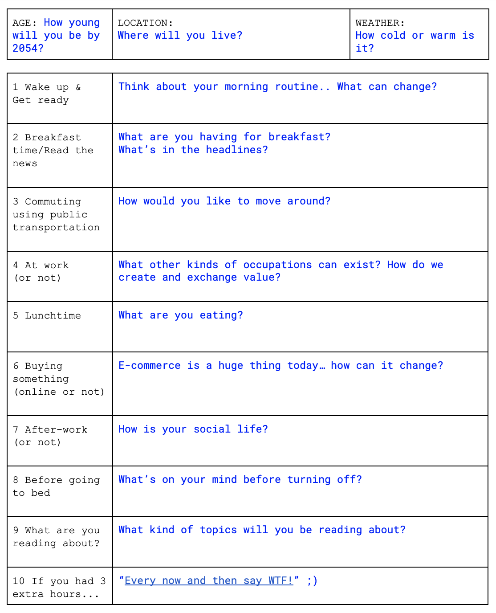
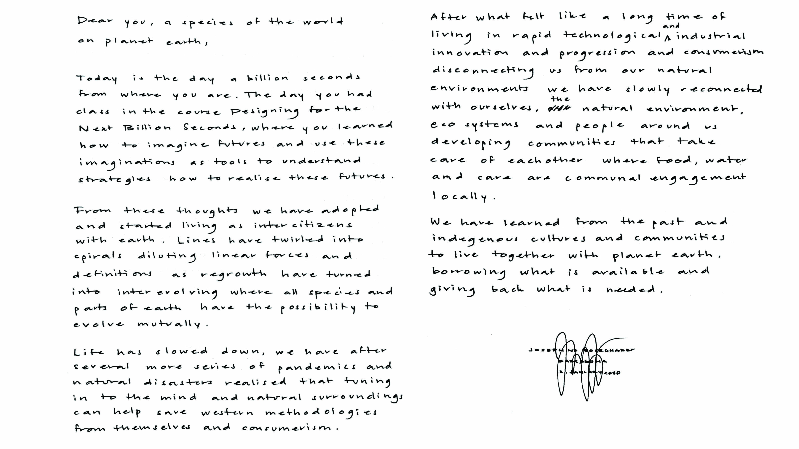

---
hide:
    - toc
---

# **DESIGNING FOR THE NEXT BILLION SECONDS**

11.01.23 - 13.01.23
Josephine Bourghardt

The first week of the second term we had the course Designing for the Next Billion Seconds with Andres Colmenares the co founder of IAM Studio. The studio works with reimagining the digital economy to encourage regeneration and interspecies communality, helping citizens and organisations to make better decisions using future design tools. We worked with different ways of exploring hypothetical questions and critical hope to imagine new futures with many collective discussions and reflections over subjects that can help explore topics to expand the imagination.

‘The Everything Manifesto’ from IAM studio was a core part of the course with a collection of proposals for changing humans complicated relationship with change. It aims to explain and propose how hypothetical questions can be used to expand the imagination and help organisations and citizens to understand complex situations and how they work with the concept of “what if” and the understanding of ‘everything’  for designing beyond boarders. 

‘Hypotheticals make visible possible worlds and worlds of possibilities, creating playgrounds where we can exercise both our imagination and skepticism. Rendering forests where much needed solidarity and collective critical hope can be cultivated today, tomorrow, during the next billion seconds and beyond.’
(https://medium.com/iam-journal/the-everything-manifesto-a-thought-experiment-for-the-next-billion-seconds-bcd9b9c938dc)

We used exercises as the ‘A day in My Post- Technological Life (2050)’ to explore different futures. A tool to imagine how a day in your life could look like in an imaginative future of how you would like the world to be. It was a great way to brainstorm and get into a creative flow. For me it helped to answer the questions rapidly without too much time to think, and then afterwards reflecting on how this imaginative future could be realised and what difficulties could arise on the way there. By doing it quickly a couple of times, different scenarios arose that could then be combined and imagined in different times and places in the world. 

Another exercise was to write a handwritten first draft of a letter sent by your future-self, in the 2050s. For me this was also a good way to get into a creative flow and letting the imagination flow. Something I will use to ‘brainstorm’ and get started in opening up thoughts. 

The everything manifesto and during the course language, words and the way things are communicated were topics that were very interesting. We spoke about that there is no singular future but plural futures, something that I will adapt in my communication. There is no one solution for all, therefor there is no one ultimate future, but multiple futures that coexist and interrelate. This also involves the word design, as there is no ultimate solution to the complex emergency the world is facing, but there is ongoing designing of multiple futures, where designing and rapidly testing along the way is an ongoing and not ending practice. We also spoke about how the using the word climate change is to neglect what is actually happening in the world where IAM studio proposes to call it an environmental emergency where climate change is one of the symptoms. Using the term climate change can be a dangerous act of neglecting the actual cause, increasing the damage of what is already happening. How we communicate and what words we use can help change mindsets and understandings. Can using the terminology of the next billion seconds help people relate to time in a different way instead of saying 31,7 years? Where ‘years’ become too far away to relate to?

Along with alternative futures we spoke about alternative economies such as the theory of Degrowth. Degrowth broadly means to shrink rather than grow economies, to use less of the world’s energy and resources and put wellbeing ahead of profit. The idea is that by pursuing degrowth policies, economies can help themselves, their citizens and the planet by becoming more sustainable. Practical actions could include buying less, growing your own food and using empty houses instead of building new ones (https://www.weforum.org/agenda/2022/06/what-is-degrowth-economics-climate-change/). 

As a theory meaning to be positive it’s interesting that the term is emphasised in a negative way. Could this way of communicating the theory cause it to be understood incorrectly? Our society is built upon the belief that we need to always grow to succeed, personally, socially, financially. But what does it really mean to grow? How can that be reframed and revalued? Is it instead that we want to evolve? Can Degrowth be ‘Inter-evolve’ where the planet, citizens and economy can mutually evolve and move forward. 

During a session in the course speaking about regrowth we spoke about western society’s linear way of acting. A line comes from the angle, something that cannot be seen anywhere in natural forms except those that have been made by mankind. Adding an arrow to the line being a power narrative being a dictation of how growth has no limit, its a linear way of thinking and living where the goal is to ‘grow’ economically, ad in power etc. In indigenous cultures and communities there are no lines but spirals - of life, the way of living, acting, nature. How can we show other ways of growing, how can we change to a system like this, something that can be very hard to imagine how to do as an individual, and how to change enough mindsets of other individuals to become a collective movement?