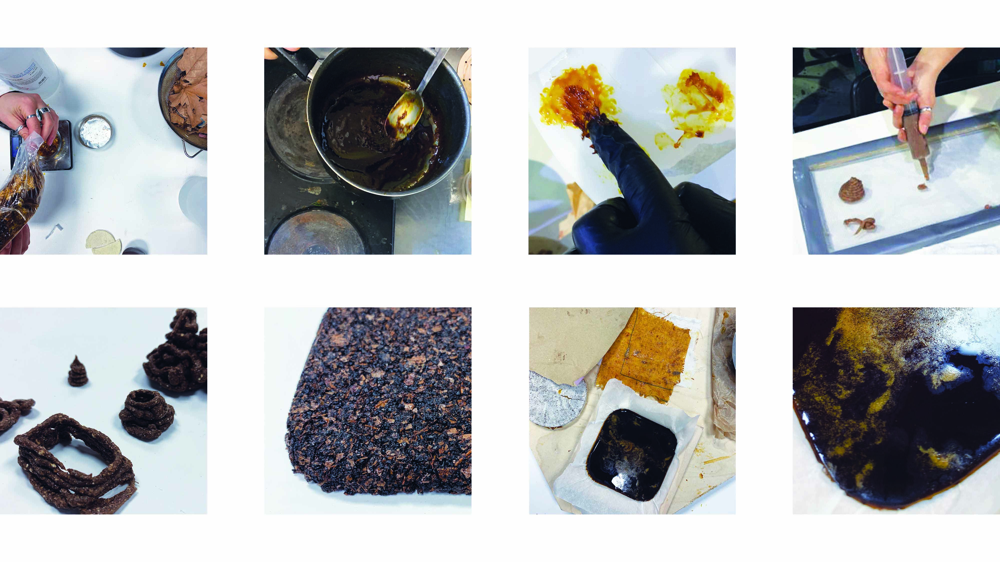
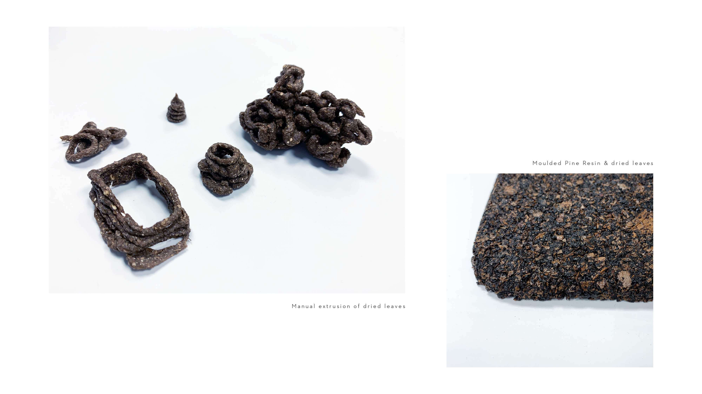
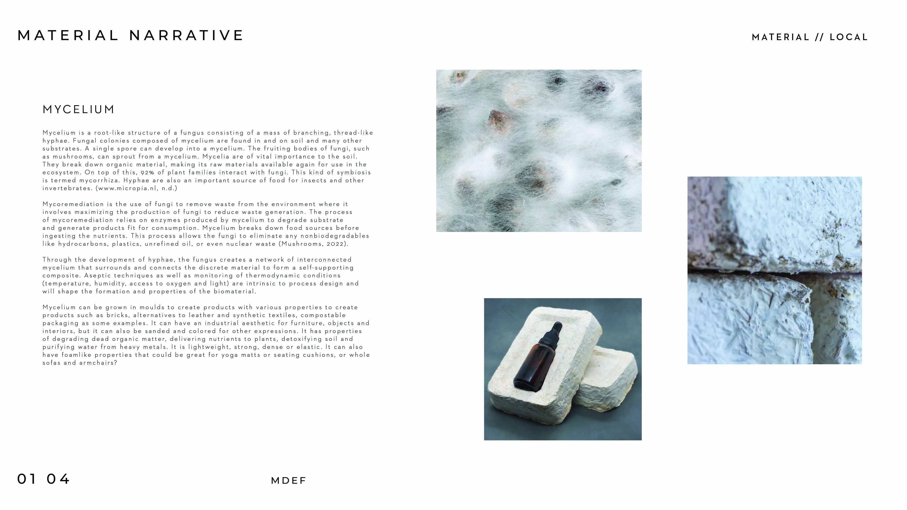
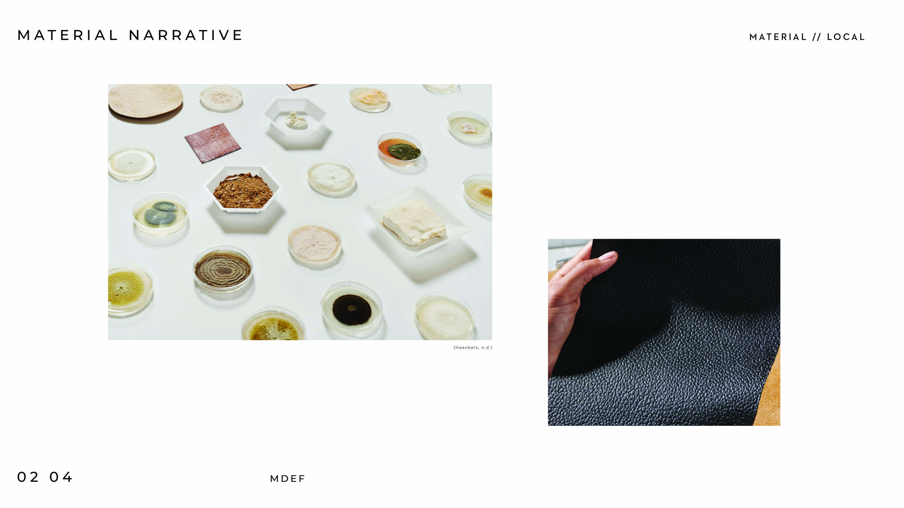
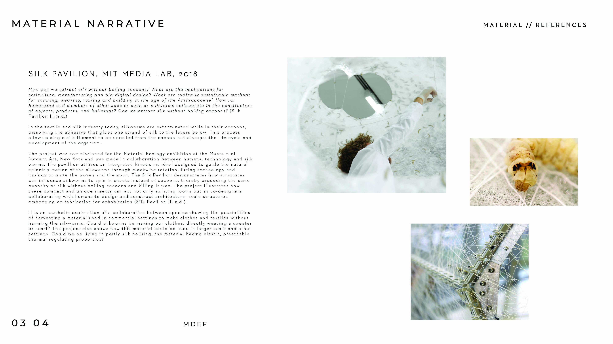
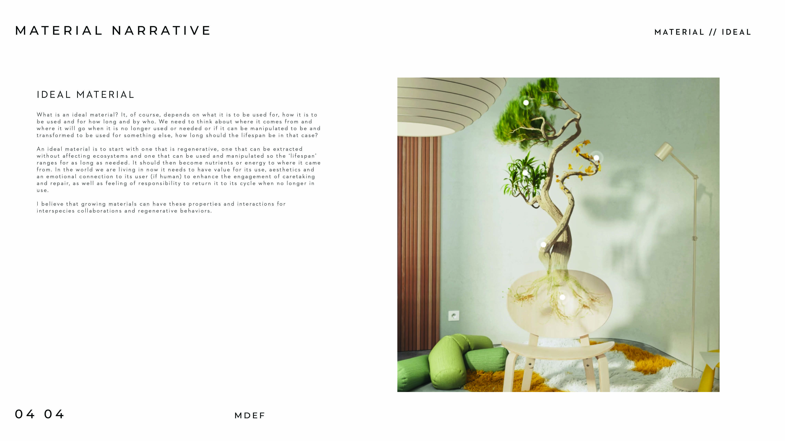
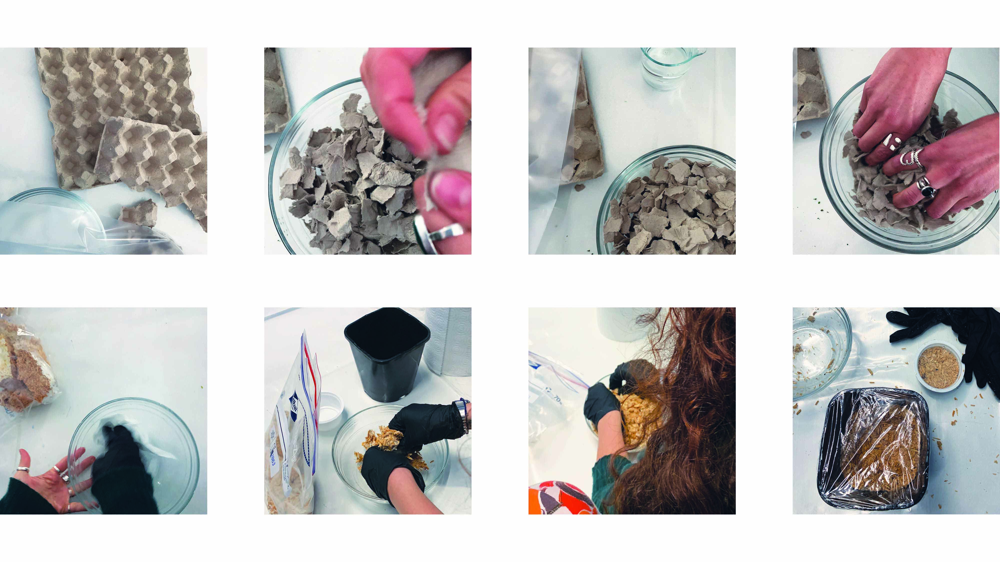
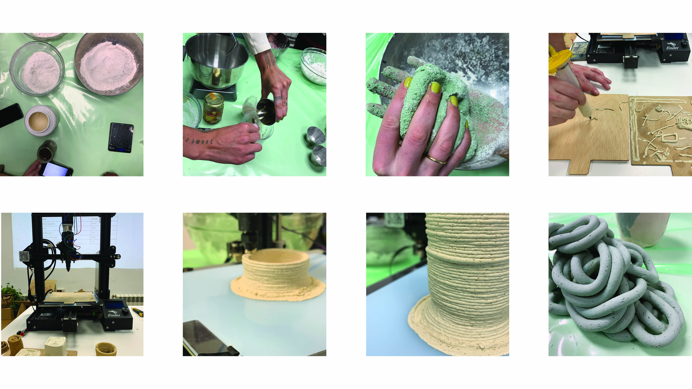
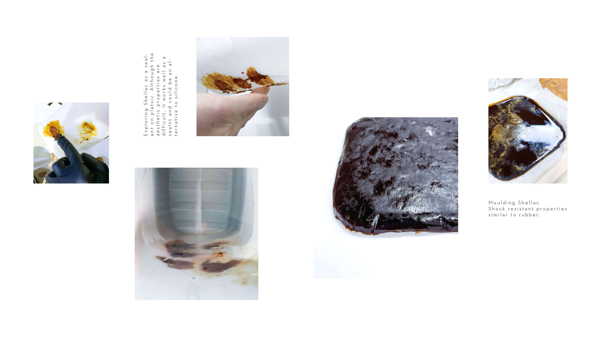
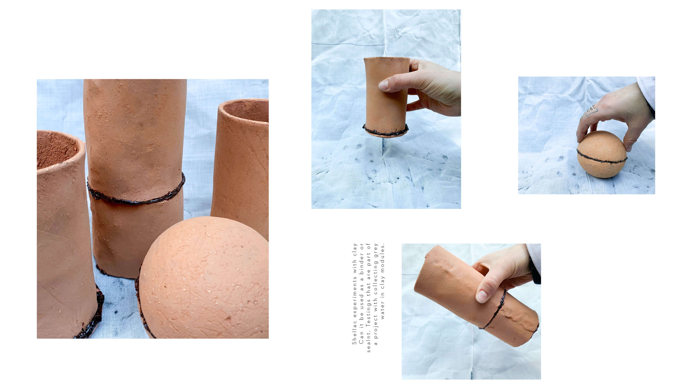

---
hide:
    - toc
---

# R E M I X I N G  -  M A T E R I A L S

18.01.23 - 20.01.23

Continuing into the second week of Term II we dove deeper into the principles of Bio Materials, with new techniques of creation, manipulation, understanding possibilities of use and communication strategies. With collected waste from around the city we prototyped with different recipes to understand qualities and properties of different techniques and combinations. During the first semester I, together with a group of four others, explored Bio Materials and waste, specifically food waste, which made this course an engaging continuation of the explorations we had started, specifically learning more about processes and methods that can be used when collecting, processing, manipulating and manufacturing. 

We were introduced to different methods of analysing and visualising use and life cycles and how and where we could project thoughts into our surroundings. We looked at lifecycles and processes of extraction & processing, manufacturing/crafting, (casting, molding, shaping, joining, surfacing, additive), manufacturing (printing, extruding), subtractive, manufacturing (milling, drilling), blowing, melting, pressing, cooking, cutting, drying, sculpting, carving, grinding, mixing, sanding, etc., consumption/use and end of the life and disposal.

During the first term we mostly explored different recipes and possibilities, where during this term and this course I want to evolve this work and explore the different manufacturing processes we’ve been introduced to such as 3D printing, moulding, casting and milling with Bio Materials. With the course I also want to explore and learn more about how to express different applications of materials, and how to create communicative and relatable narratives and mediums of expression. 

MATERIAL NARRATIVE EXCERCISE

GROWING MATERIALS with S Biótica

We visited S Biotic and their studio where we were introduced to their practice and how the use and learn from growing living materials. We spoke about how materials can be living and transforming as we do with their own communication and narratives, rhythms and cycles. We are living in a time where we as consumers are detached from the materials around us. How can taking a step back to reflect and analyse on how materials make you feel, think, connect and collaborate with non human life, organic and living materials create a regenerative connection to the world and our surroundings? 

An interesting topic is how we live in an ever changing world but still have the perception that the things that we make and the materials we produce need to hold for a very long time. What if we were to instead mimic the aspect of the living, using the life cycle in design processes and other directions and question what is it to be and think with care when designing with the living around us. Should materials and products really hold for hundreds of years, or could the lifespan of a material be only of what it is to be used for and later deteriorate and return to nature with the nutrients needed. 

It was also interesting to talk about how working with other living organisms is a collaboration between a designer and other living things. You can tell it what to do, but that doesn’t mean that it will do it. An aspect that can be hard to grasp within traditional design thinking where human needs are at the centre of solutions and humans have controlled the outcomes. Letting go of control as a designer and letting others be a part of deciding the process is what can lead to innovation solutions, as seen in many topics of collaborations between disciplines, so collaborating with other living organisms should be a natural part of this process as well. 

To understand this collaboration hands-on we worked with mycelium, learning about the specific properties, feeding, temperature and processes for it to grow in molds that we brought.  

3D PRINTING WITH BIO MATERIAL PASTE

During the second week we were introduced to the 3D printers that FabLab have been working on to self fabricate and 3D print with paste such as clay and Bio Materials. We worked hands on printing with both materials to understand how clay and bio materials react and behave when printed. I have 3D printed before using plastics and explored 3D printing with clay, but to use Bio Materials was a new experience, one that is very interesting in the projects that I worked on together with my group during the first term, as well as the continuation of them in the second term. By 3D printing waste can be reduced within the manufacturing process and create possibilities of closed loop material systems where waste can become new materials, composted or reused. There are also interesting projects where living cells are incorporated into 3D printed materials creating functional and biological active structures.

MOLD // CASTING

We were also introduced to moulding and casting and the techniques that can be used, understanding material properties and what moulds could be sufficient and work well with different Bio Materials. I am together with a couple of others working on a project exploring BioMaterials and how the form of tableware and objects in a dining experience affect the experience of eating. Exploring form, texture, biomaterials, perceptions and senses in the relationship we have with food, waste, eating and cooking. We experimented with casting pine resin and food waste. We used simple moulds, in silicone as well as everyday objects, and clay moulds. Due to the mixture of pine resin and the amount of additives, where we explored coffee grounds and orange peels, we had difficulties filling out the moulds and removing the cast. 3D printing can be an alternative here, as well as casting in soft silicone moulds where the material can be removed more easily.

These techniques are also interesting in experimenting with printing clay to create a modular system of water collecting pots where individuals can collect grey water to reuse as well as experiment with growing directly in or on the pot. 

MATERIAL NARRATIVES

Throughout the two weeks I was working together with Claudia and Cagsun exploring the techninques we learned and investigating the materal propoerties and use of the Shellac as an alternative to silcone. As part of a project working with water we wanted to investigate a bio material that can seal or act with water restistant properties. We experimented with different Shellac recipes and applications to learn how it reacts with different materials and how it could be applied to the grey water collection module system we are working on this term. It has sealing propoerties and could be a good alternative to using silicone. It can be reheated and reworked and could be used to seal modular pieces. We will further be experimenting with using it as a varnish on unfired clay to investigate if a clay form could be water resistant, while still holding moist to also hold plants. 

<iframe src="https://docs.google.com/presentation/d/e/2PACX-1vTEK-Wj4RHf5l3vqxigyaCjnflT23GnIZ6B1ugXmonSLfkAWz6iUlFEbV-7d79aj0570C-cCr-3WtRQ/embed?start=false&loop=false&delayms=3000" frameborder="0" width="960" height="569" allowfullscreen="true" mozallowfullscreen="true" webkitallowfullscreen="true"></iframe>

