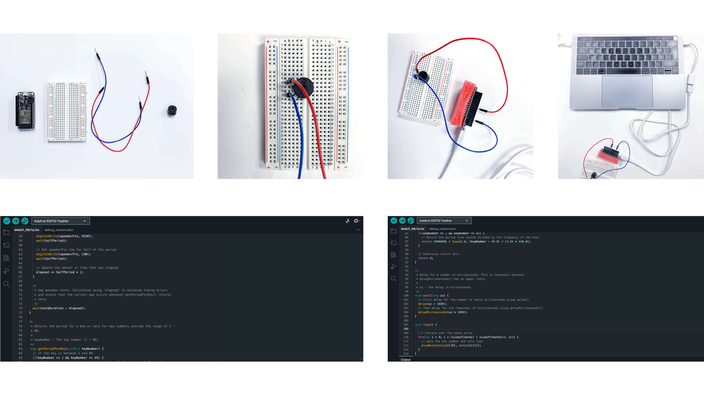
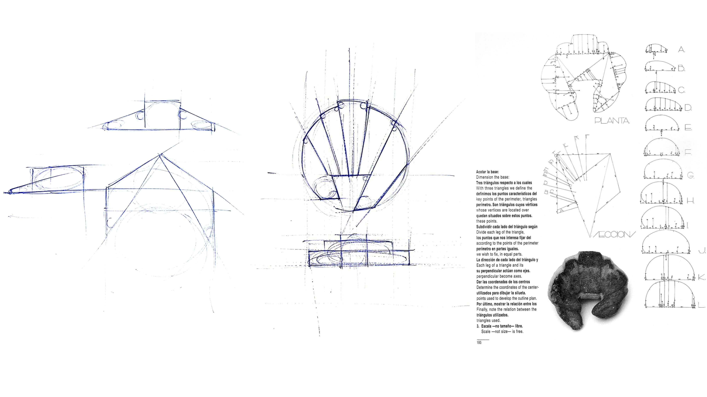
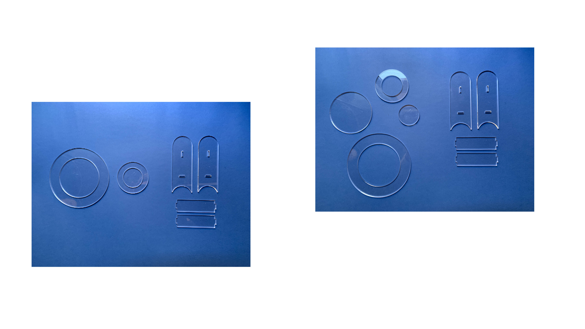
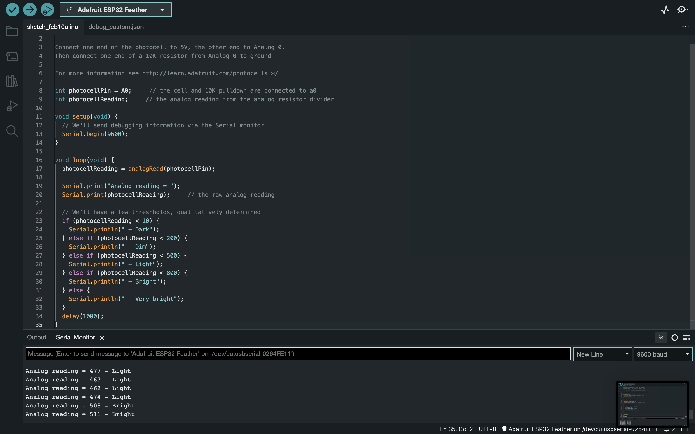
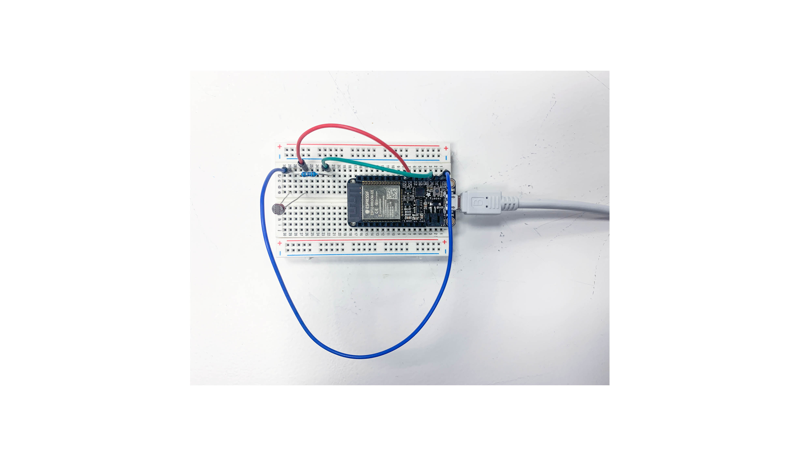
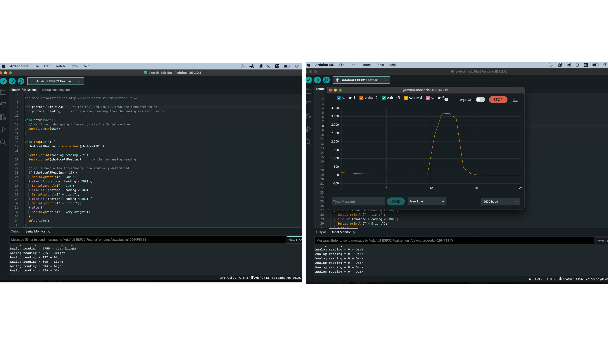

---
hide:
    - toc
---

# **PROTOTYPING FOR DESIGN**
This section will be part of a weekly journal where I’ll be documenting what we are doing during the course Prototyping for Design. Parts of it will be very simple documentation of the process for future use and understanding

P R O T O T Y P I N G  T O G E T H E R 
01.02.23

Starting off the course we were reintroduced to electronics and Arduino receiving homework to create music with an ESP32 and a buzzer. Since I haven’t worked with it before the one week course during the first term I will be documenting this step by step for remembering how to get started in the future.

Creating music with Arduino and buzzers 
We used a ESP32 microcontroller, a Piezo buzzer that is an electronic component that can make sounds, beeps or play music, a bread board and connection wires and pins which are then connected through Arduino IDE and code to make sounds.

There are lots of tutorials that show how to do this exercise where I followed this one for setting up the microcontroller, breadboard and buzzer. For the code I used an already existing one where I practiced creating a loop instead of the music stopping and tried different melodies. 

For me, this exercise was a good refresh in what we did in the first term, allowing me to in a simple exercise practice restarting Arduino IDE, where we hade to reinstall a new version, but most of all it was a good way to learn how to search for information about how to get started with projects and what to search for to find relevant information. 

D I G I T A L I Z I N G  - R E A L I T I E S 
02.02.23
Today we had a presentation about digital tools for 2D, 3D, parametric and generative deisgn. We started off by communally adding programs we have worked with in the past to a Miroboard. I have used 2D and 3D programs for modelling before such as Illustrator, Rhino, Solidworks, Grasshopper, Sketchup to create 3D and 2D models and files for digital manufacturing, where I now saw so many interesting programs and other ways of working. Although I have worked in 2D and 3D to create models and files for digital fabrication there were many terms and things I was not aware about or not complete sure of why I used, I had just learnt that that’s how you do it. 

List 

Computer Aided Design (CAD)
Computer Aided Manufacturing (CAM) 

Building Information Modeling (BIM) is the foundation of digital transformation in the architecture, engineering, and construction (AEC) industry. A holistic process of creating and managing information for a built asset. Based on an intelligent model and enabled by a cloud platform, BIM integrates structured, multi-disciplinary data to produce a digital representation of an asset across its lifecycle, from planning and design to construction and operations.

Pixel: square in a x/y grid, smallest unit of bitmap images (called rester image or bitmap)average phone take millions of pixels in an image (GPU processed) Light data to store but heavy file. In Computer graphics, a pixel, dot, or picture element is a physical point in a picture. A pixel is simply the smallest addressable element of a picture represented on a screen. A majority of pictures that we see on our computer screen are raster images. The selfie that you click with your mobile phone is another example of a raster image. An image is made up using a collection of pixels referred to as a bitmap. Each pixel is made up of RGB sub pixels. It allows to store complex textures and gradients. It has multiple formats with a variety of compressions and processing requires less processor load. It needs a lot of RAM to store textures and uses a lot of memory. It loses quality when enlarged

Bitmap: In computer graphics, a bitmap is a mapping from some domain (for example, a range of integers) to bits, that is, values which are zero or one. It is also called a bit array or bitmap index. The more general term pixmap refers to a map of pixels, where each one may store more than two colors, thus using more than one bit per pixel. Often bitmap is used for this as well. In some contexts, the term bitmap implies one bit per pixel, while pixmap is used for images with multiple bits per pixel.

Raster - Raster images use bit maps to store information. This means a large file needs a large bitmap. The larger the image, the more disk space the image file will take up. As an example, a 640 x 480 image requires information to be stored for 307,200 pixels, while a 3072 x 2048 image (from a 6.3 Megapixel digital camera) needs to store information for a whopping 6,291,456 pixels. We use algorithms that compress images to help reduce these file sizes. Image formats like jpeg and gif are common compressed image formats. Scaling down these images is easy but enlarging a bitmap makes it pixelated or simply blurred. Hence for images that need to scale to different sizes, we use vector graphics. 
File extensions: .BMP, .TIF, .GIF, .JPG

Vector - The geometrical (mathematical) description of an image. It can be enlarged as many times as you want without losing quality and allows for easy editing and changes. It is also lighter than pixel format images. Making use of sequential commands or mathematical statements or programs which place lines or shapes in a 2-D or 3-D environment is referred to as Vector Graphics. Vector graphics are best for printing since it is composed of a series of mathematical curves. As a result vector graphics print crisply even when they are enlarged. In physics: A vector is something that has a magnitude and direction. In vector graphics, the file is created and saved as a sequence of vector statements. Rather than having a bit in the file for each bit of line drawing, we use commands which describe a series of points to be connected. As a result, a much smaller file is obtained. The cons with vector formats are that they don’t store texture and don’t allow complex gradients as in photography.
File extensions: SVG, EPS, PDF, AI, DXF

Basics of a computer · 
CPU · Vector. heavy mathematical equations · Constructed from millions of transistors, the CPU can have multiple processing cores and is commonly referred to as the brain of the computer. It is essential to all modern computing systems as it executes the commands and processes needed for your computer and operating system. The CPU is also important in determining how fast programs can run, from surfing the web to building spreadsheets.
GPU · Graphic Processing Unit · Raster. The GPU is a processor that is made up of many smaller and more specialized cores. By working together, the cores deliver massive performance when a processing task can be divided up and processed across many cores.

RGB stands for red, green and blue. RGB uses light to produce color: the more illuminated light involved, the lighter the image. RGB produces the widest range of color. RGB colors are typically used on computer monitors, digital cameras and televisions — any device that uses light to produce an image.

CMYK stands for cyan, magenta, yellow and black. This category of color uses the combination of ink pigments to produce color. The less ink used, the lighter the image; the more ink used, the darker the image. Printing projects typically use the CMYK color category.

sRGB (storeRGB) Color utility, mainly used on internet, save as this when uploading. It has less cooler rendering and shouldn’t be used for printing.

Resolution is the product of width and height of a digital image expressed in pixels. How many pixels and the density are measured in pixels per inch (PPI) and are what determine the quality of an image
72 PPI used on the Internet
300 PPI high resolution image
320 PPI average of what a human eye can see
600 PPI are used in professional printers
Phone screens today have normally around 400-600 pixel, some 900.  can’t see the difference, marketing sales point

FILE FORMATS
JPEG file compressing, loses quality for every time its opened
PNG compression less - heavier image, but doesn’t lose quality

MESH // NURBS 
NURBS model consists of points connected by curves. (freeform modeling, fluid shapes with a lot of complexity, at the same time being easy to modify.) Its a mathematical model used in computer graphics to generate curves and surfaces. It generates a precise geometry with smooth surfaces with geometries that are mathematically defined using control points that create complex curves to form surfaces around them. Used by many 3D scans and is ideal for CAD based programs as it is more accurate, takes less space and is easy to translate to different programs. 

MESH, GPU - A collection of verticles, edges and faces as a structural construction of a 3D model consisting of triangles, quadrilateral or other polygons. 3D meshes use reference points of x,y, z axes to define shapes with width, height and depth. Object smoothness is achieved by increasing the number of polygons within a model, this also affects the filesize making it very heavy.  Not good for scaling as the polygons increase or decrease in size while scaling affecting the surface and form.  STL file for manufacturing where it uses xyz points. 3Dscanners always a mesh, points in space, triangles that create the visual surface. 

Modelling and 3D printing is usually based on a NURBS model and then converted to a MESH model for manufacturing in CAM

CAD surface models are usually created using NURBS surfaces, while 3D scans are typically exported as a polygon mesh. The conversion from a polygon mesh to a NURBS model is called “reverse engineering”. Worked by the CPU. 

PARAMETRIC DESIGN a process based on algorithmic thinking that allows the expression of parameters and rules that together define, codify and clarify the relationship between design intent and design response. The term comes from mathematics and refers to the use of parameters or variables that allow the final result of an equation or system to be manipulated or altered. Its time saving, can create unique and exclusive designs, its adaptable to space conditions, contributes to greater architectural and manufacturing freedom where it goes hand in hand with digital fabrication without extra cost for same amount of effort to create different shapes, all shapes can be individual, high customisation. Traditional fabrication methods can’t realise the demand on this individualisation.

TOPOLOGY OPTIMISATION · Using Algorithmic Models to Create Lightweight Design · Topology optimization (TO) is a shape optimization method that uses algorithmic models to optimize material layout within a user-defined space for a given set of loads, conditions, and constraints. TO maximizes the performance and efficiency of the design by removing redundant material from areas that do not need to carry significant loads to reduce weight or solve design challenges like reducing resonance or thermal stress. Designs produced with topology optimization often include free forms and intricate shapes that are complex or impossible to manufacture with traditional production methods. However, TO designs are a perfect match for additive manufacturing processes that have more forgiving design rules and can easily reproduce complex shapes without additional costs.

GENERATIVE MODELLING Generative design is an iterative design exploration process that uses an AI-driven software program to generate a range of design solutions that meet a set of constraints. Unlike traditional design, where the process begins with a model based on an engineer’s knowledge, generative design begins with design parameters and uses AI to generate the model. By modifying the design parameters in an increasingly refined feedback loop, engineers can find highly optimized and customized design solutions to a wide range of engineering challenges, such as making product components lighter, stronger, and more cost-effective. 

 TOPOLOGY OPTIMISATION VS GENERATIVE MODELLING The start of its process requires a human engineer to create a CAD model, applying loads and constraints with project parameters in mind. The software then removes redundant material and generates a single optimized mesh-model concept ready for an engineer’s evaluation. In other words, topology optimization requires a human-designed model from the outset to function, limiting the process, its outcomes, and its scale. 
In a way, topology optimization serves as the foundation for generative design. Generative design takes the process a step further and eliminates the need for the initial human-designed model, taking on the role of the designer based on the predefined set of constraints.

AGENT MODELLING · Computer simulations used to study the interaction between people, places and time. Built bottom up meaning 

LIST OF RESOURCES FROM FABLAB PRESENTATION
CAD - Resources¶
Image compression tools
Image compression for web size
Image compression online tool

2D Design Tools
Online SVG vector drawing online (Free + Opensource Graphic Editor)
Online Raster edition program
Online Vector edition program
Inkscape (Free + Opensource Graphic Editor)
Inkscape Introduction
Inkscape - Lecture
Gimp (Free + Opensource Image Editor)
Gimp and Bitmap Introduction - Lecture
QCad (Free + Opensource for CAD in 2D)
QCad Introduction - Lecture
Vectr on browser - free graphic editor

3D Design Tools
3D CAD: 3D Modeling Tools for Beginners
Blender (Opensource 3D creation)
Blender Introduction - Lecture
Blender Master Class 2017
Freecad (Free + Opensource parametric 3D modeler)
Freecad Introduction - Lecture
Freecad for Beginners - Spanish!
Rhinoceros 3D (Commercial 3D Cad software)
Rhinoceros 3D - Nurbs

Grasshopper- Rhinoceros Resources
Grasshopper Master Class 2017
File - Grasshopper Master Class
SolidWorks (Commercial 3D Cad Software)
Video tutorials for beginners, advanced, etc
Lego tutorial by Ferdinand Meier
Onshape
OpenScad
GENERATIVE WITH Fusion360

3D SCULPTING
https://www.womp.com

EDIT FILE TOOL
PIC SVG Image Conv, transform your images to sag vector files
Tiny jpg - image compression
Terrain STL 

Repositories
THINGIVERSE - 
STL Finder

http://flatfab.com

Finite Element Analysis FEA
Ameba plugin for grasshopper

3D video capturing time 
https://www.depthkit.tv

BLENDER image ai generator

https://www.simscale.com
http://flowsquare.com
https://jthatch.com/Terrain2STL/

As an exercise we were to during the presentation represent what we thought could be the parametric variables of a croissant. We could draw it by hand, digitally or directly on MIRO. I drew it quickly without thinking too much, where it is built up of geometric shapes. 

2 D - M O D E L L I N G
08.02.23
This week involved introductions to Lasercutting. I have worked with laser cutting before, although it was a while back. Yet again there were many terms and methods I haven’t known the names of or why they are used. I have used laser cutting for making patterns and stencils for moulds and prototypes. 

Terms & Methods

CNC - Computer Numerical Control. 
Digital prototyping is CNC  in different ways, laservutting etc (https://en.wikipedia.org/wiki/Numerical_control)

LASER Light Amplification by Stimulated Emission of Radiation - a technology that works by directing the output of a high power laser through optics. The focused laser beam is directed at the material, which then melts, burns, evaporates or is entrained by a gas jet, leaving an edge with a high quality surface finish

Digital Fabrication
Input device, computer - saved file - output device - physical output 
CAM to CAD

Plastic, wood, cardboard, fabrics, organic materials

Micro processor vs microcontrollers (processor- like computer brain can freeze, controller like a button control, controlling hardware)
https://www.naukri.com/learning/articles/difference-between-microprocessor-and-microcontroller/

https://www.archdaily.com/797107/50-downloadable-digital-joints-for-woodworking

Nesting - there are programs that do it for you
Rhino nest, fusion has it too
SVG Nest
Tolerance- Laser is 0.2
Slicer Fusion - Stacks and names the pieces, helps to make waffle

References FabLab Lasercutting
https://wiki.fablabbcn.org/Main_Page 
https://www.iaacblog.com/programs/courses/otf/ 

To put theory into practice we were to use a method to Laser cut something. I am currently working with water, where I am testing different clay modules to collect and hold water. This excercise was used to lasercut a simple form that will act as a mould for clay when drying where I am experimenting with forms in a modular system. a simple form that can be used as a mould to form clay and keep it in place while drying. I also lasercut a couple forms that we will be using as moulds for bio materials where we are creating different tableware, we chose as a group to make moulds in different forms that we could use to test different materials.From simple circular forms we can test size and material properties.

This was a good reintroduction to lasercutting as it was a while ago I used it, as well as learning terms and the use of different Lasercutting machines and how they work.   

Therafter we were to choose a new peogram that we want to learn. I chose to work in Blender wehere I would like to learn how to create animations to compliment communication. I staretd with a simple animation of a bouncing ball to understand the program and methids that can be used, where I want to keep trying out fluids to make animations animating water flows. 

<iframe width="560" height="315" src="https://www.youtube.com/embed/cYiEOO4KUwU" title="YouTube video player" frameborder="0" allow="accelerometer; autoplay; clipboard-write; encrypted-media; gyroscope; picture-in-picture; web-share" allowfullscreen></iframe>

I want to learn to work with animations and motion graphics to compliment the communication of this terms project about water systems, showing citizens how they work and how they can be hacked, this could be an interesting option. I therafter experimented with After Effects and motion graphics, where I tried different ways of simulating water. At the moment I am playing around in the programs to learn by doing.
<iframe width="560" height="315" src="https://www.youtube.com/embed/czGsU_-qwJE" title="YouTube video player" frameborder="0" allow="accelerometer; autoplay; clipboard-write; encrypted-media; gyroscope; picture-in-picture; web-share" allowfullscreen></iframe>

<iframe width="560" height="315" src="https://www.youtube.com/embed/QmeB5dBiOAo" title="YouTube video player" frameborder="0" allow="accelerometer; autoplay; clipboard-write; encrypted-media; gyroscope; picture-in-picture; web-share" allowfullscreen></iframe>

I N P U T S  &  O U T P U T S
09.02.23
The second part of the week we learned about inputs and outputs, looking at different sensors, what they can do and how. We looked at how to choose a sensor for what you want to do, which was very good for a beginner in electronics. 

This was very interesting to look at as I am within a group working with grey water, collecting, filtering and reusing it. Smart Citizen Kits exist for measuring water quality of the ocean, a great way for citizens to collect information about their surroundings to better understand it to enable actions. Could a similar kit exist for measuring water quality in tap water or in grey water collection for reuse? Could this give citizens a better understanding of the water systems in the city? Create trust to the information about the water systems available? Or distrust, empowering through knowledge to take actions and question the systems?

Another project - Clean Water AI - would also be interesting to work with and try, or could a combination of these projects create a simple way for citizens to use and understand there surroundings..

https://www.hackster.io/clean-water-ai/clean-water-ai-e40806
https://docs.smartcitizen.me/Components/Soil%20and%20water/#atlas-scientific-carrier-board
https://www.demandsage.com/helium-10-alternatives/

To put theory into practice we worked with two different boards trying different inputs and outputs. 
The first board was to understand how to connect a LED and a button and to make the LED light up when the button is pressed. We learned that in Arduino IDE there are options with preset code which we used here choosing the option 'Button'. We disconnected parts of the code as comments to test

We then worked on a board with a Photo Cell, which is a sensor allowing to detect light, experimenting with light resistance, testing different light properties in the room to start with before connecting it to the first board to therafter sense the LED light that lights up when the button is pressed. https://learn.adafruit.com/photocells

After adding pins and resistors it worked and showed light detected, although not very well, it didn't show very much difference from dark and light. We used a 100K ohm resistor as the instructions assigned, and then tested different resistor ohms we tried a 10K which didnt change the resistance, there was still not a big difference from light to dark. 

We then tried to change the code where instead of different values for light resistance, it would have a high and low, but this didnt work at all, so we went back to the first code we used and  realised that there was information missing, where changing and updating the pinnumber made it work as we wanted. It then went from very bright to dark depending on the light in the room. 

When testing the light resistancy together with the LED to see how the light resistancy could read the LED when lit we had problem with our LED not working anymore, we now have to find why it isn't working before we can connect the boards. 

N E T W O R K I N G
22.02.23

In this class we spoke about the internet and how it can be seen as one of the most complex copying machines ever invented. Built up and used in networks, which are a set of devices connected to each other through any type of communication lines that allow the exchange of data between them. In a way it's network of devices that are copying bits from one place to another. When you access a website you're only copying a file from one computer to yours. 

Jeroen vaan Loon materializes a glass internet filled with smoke signals. For his latest piece ’an internet’, the artist’s motivation was a simple question: how would the internet look like if all data were temporary and ephemeral?

When using the internet we have and share copies of our data all over the internet. Are we willing to share our information in that way? What happens to the world, cultures understandings of selves when information is available everywhere and all the time?

Culture and ethics. We become ourselves through our local relationships, people, situations, culture, school, work - they make us think and be in a specific way. What happens when we build relationships with places and people in a larger network, we build a picture or way of being in our head, but it can be very different from how we are physically, disconnecting us from our local selves, hard to adapt to physical reality. Are people living in parallel realities through social media for example? What happens when young people see things on social media without a critical mind, believing that what they see is someones reality? Or believing that what they post is what is the important reality? The one that can be designed to look the way you prefer? 

People can tend to seperate things in poles, what is right and wrong, which can become very black and white. Ideas can then become very big and strong, compared to what they really are, especially as we tend to connect with people or things that reinforce what we are saying, that say that we're right, creating lots of small echo bubbles which can become a dangerous thing. 

Is it necessary to be connected all the time, do we need to write to someone sitting next to us? When oing so this data moves through multiple layers mving large distances before reaching the receiver. Do you really need to be always connected?  Do we really need to send things all over the world to send a message? Why can’t we send things locally? If we are all on the same wifi, why cant we just send data in this layer? 

In the class we used our Arduinos and created our own network, it was decided who was part of it and who could connect with who. 

3 D  M O D E L L I N G  C N C 
23.02.23

I N T E R F A C E  ·  M A C H I N E  v s  M A C H I N E 
0 1 . 0 3 . 2 3

Today we did many of the things that we have already done in class, but this time with a very hands-on approach, by learning through doing and then reading in on what we had done. This was for me a very good way to learn and I felt like I understood what I was doing a lot more. 

Practically all we used was an Arduino, a bread board and a LED light, but used the LED in different ways. 

T H E - H A R D - C O D E D - W A Y

Finding the code in Arduino IDE and using basic, here its important to change the LED to a pin so it doesn’t use the LED on the Arduino. Here we changed it to LedPin 14 in all of the code and the LED blinks within the time frame put in the code of the led being on and off. We have done this in classes before, but for me this was really the first time that I understood what I was doing and how I could controll the code and the Arduino. 

A S K I N G - F O R - I T

We can add a message and make it do what we ask it to do. I tested very simple actions by adding blink twice and blink twice slowly. I wanted to start with simple things to actually understand what I was changing in the code and how the LED acted from that. 

M A K I N G - I T - D O - A N I M A T I O N S

We installed and used the library JLed which includes code that makes the LED act in different ways, breathe for example where it lights up slowly and fliuidly as a breathe. There are many possibilities to play with LEDs, connecting many in different light patterns for example. 

A S K I N G - I T - F R O M - T H E - I N T E R N E T  (I and II)

Last week we worked on this, but in a different way, where we made our own 'network' in the class and sent messages to eachother within it. What we did today was similar but for me explained in a very understandable way. 

MQTT trigger things or get things from sensors. The concept of MQTT is as simple as that you have a server: the MQTT broker, that can sense things. It's a big part of the internet of things IOT. Then we have publishers - sensors that could be anything, for example a computer. Then we also have subscribers that are listening to the broker and waiting for the broker to tell them what to do. 

M A K I N G  - S E N S O R S - T O - D O - I T - R E M O T E L Y 

